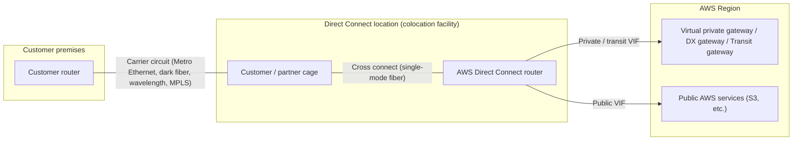
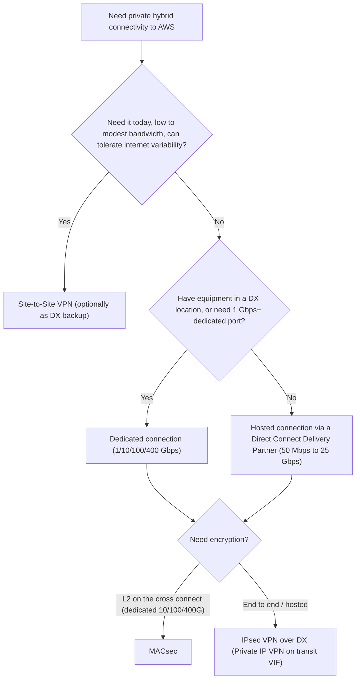

# AWS Direct Connect Overview

AWS Direct Connect (DX) links your internal network to a Direct Connect location over a standard Ethernet fiber-optic cable, so you can reach AWS public services and your VPCs without going through internet service providers. This page explains what DX is, its building blocks, when to pick it over Site-to-Site VPN or the internet, and what changed between 2023 and 2026. Facts were verified against AWS documentation and What's New posts as of 2026-09-30.

## What Direct Connect is

One end of the cable plugs into your router (or your partner's router) and the other into an AWS Direct Connect router in a colocation facility called a *Direct Connect location*. Over that physical link you create *virtual interfaces* (VIFs), which are 802.1Q VLANs carrying BGP sessions to AWS.

- A Direct Connect location gives you access to AWS in the Region it is associated with.
- A single connection in a public Region or AWS GovCloud (US) can reach public AWS services in all other public Regions (China excluded).
- With a Direct Connect gateway, one connection can reach VPCs in any public Region (China excluded). Traffic stays on the AWS global backbone.

## Components

| Component | What it is | Details |
| --- | --- | --- |
| Direct Connect location | A colocation facility where AWS has DX routers | Over 150 locations worldwide (per 2026 What's New posts). See [02-connections.md](02-connections.md). |
| Connection | A physical Ethernet port on an AWS DX router | Dedicated (1/10/100/400 Gbps) or hosted (50 Mbps to 25 Gbps) |
| Cross connect | The fiber patch between your (or your provider's) equipment and the AWS port | Ordered from the colocation provider using the LOA-CFA |
| LOA-CFA | Letter of Authorization and Connecting Facility Assignment | AWS issues it; it authorizes the cross connect to a specific patch panel port |
| Link aggregation group (LAG) | Several dedicated connections bundled with LACP | See [03-lag-and-macsec.md](03-lag-and-macsec.md) |
| Virtual interface (VIF) | A VLAN plus BGP session on a connection | Private (to a VPC or DX gateway), public (to AWS public IPs), transit (to Transit Gateway or Cloud WAN through a DX gateway) |
| Direct Connect gateway | A global object that lets private/transit VIFs reach VPCs or transit gateways in many Regions and accounts | Not available for China Regions |
| MACsec | IEEE 802.1AE Layer 2 encryption on the cross connect | 10/100/400 Gbps dedicated connections at select locations |

## Direct Connect vs Site-to-Site VPN vs internet

AWS positions Direct Connect for dedicated, private network connections, and Site-to-Site VPN for an "immediate need, low to modest bandwidth requirements", where you "can tolerate the inherent variability of internet-based connectivity" (DX FAQ). Many designs use both: VPN as a backup path, or IPsec VPN on top of DX (Private IP VPN on a transit VIF) when you need encryption above Layer 2.

| Aspect | Direct Connect | Site-to-Site VPN | Plain internet |
| --- | --- | --- | --- |
| Transport | Private fiber to a DX location, then the AWS backbone | IPsec tunnels over the internet (or over DX) | Public internet |
| Bandwidth | Dedicated 1, 10, 100, 400 Gbps; hosted 50 Mbps to 25 Gbps; LAG up to 4 x 10G or 2 x 400G | Up to 1.25 Gbps per standard tunnel, up to 5 Gbps per Large Bandwidth Tunnel (Transit Gateway or Cloud WAN only, launched Nov 2025) | Best effort |
| Latency / jitter | Consistent, provisioned path | Varies with internet conditions | Varies |
| Time to deploy | Days to weeks: port provisioning (up to 72 business hours), then cross connect and carrier circuit | Minutes | Immediate |
| Encryption | Not encrypted by default; add MACsec (L2) or IPsec VPN over DX | IPsec built in | TLS at application layer |
| Cost model | Port hours plus data transfer out at DX rates (flat-rate option since Sep 2026) | Per connection hour plus internet DTO | Internet DTO |
| SLA | Up to 99.99% with the Maximum Resiliency model | Separate VPN SLA | None |

## Resiliency models and SLA

The Direct Connect Resiliency Toolkit (the "Connection wizard" in the console) orders the right number of dedicated connections for a target SLA.

| Model | Topology | SLA |
| --- | --- | --- |
| Maximum Resiliency | Separate connections terminating on separate devices in more than one location | 99.99% |
| High Resiliency | Connections in multiple locations | 99.9% |
| Development and Test | Separate connections on separate devices in one location | Not specified (for non-critical workloads) |
| Classic | One-at-a-time ordering without the toolkit | 95%, no resiliency or redundancy |

Buildings that together form one Direct Connect location (for example Equinix DC2/DC11, or the Equinix SE2 and Digital Realty SEA10 sub-locations in one Seattle building) do not provide location-level diversity, so for high availability use different locations. Source: the footnotes on <https://aws.amazon.com/directconnect/locations/>.

## Pricing basics

- Two billing elements: port hours and data transfer out (DTO). Data transfer into AWS is free.
- Port-hour price depends on capacity and connection type (dedicated or hosted).
- Dedicated connection billing starts when the port becomes active or 90 days after the LOA-CFA is issued, whichever comes first.
- Hosted connection port hours are billed once you accept the hosted connection.
- Flat-rate pricing (announced September 2026): for 10G and 100G dedicated connections, a fixed hourly rate by bandwidth and geographic tier (five tiers from same-metro to global) with no DTO within the tier. A "port-pair" includes a redundant second dedicated connection at no additional charge. You can switch billing modes at any time. Not available in China Regions.

## Recent changes (2023 to 2026)

| Date | Change | Layer |
| --- | --- | --- |
| 2024-04-24 | Hosted connections up to 25 Gbps (select partners, only where 100G ports exist) | Connection |
| 2024-07-01 | Native 400 Gbps dedicated connections at select locations (400GBASE-LR4) | Connection |
| Undated (current docs) | MACsec documented for 400 Gbps dedicated connections (GCM-AES-XPN-256); the 400G launch post of 2024-07-01 did not mention MACsec, and the locations page now marks all 400G sites with (M) | Connection |
| 2025-07 | MACsec extended to partner-owned interconnects at 100+ PoPs | Connection |
| 2025 to 2026 | Steady location growth: e.g. Barcelona (2025-08), Auckland, Nairobi, Madrid MAD3 (2025-09), Hanoi (2025-12, first in Vietnam), Sydney SY5 (2026-03); 100G expansions in Chennai, Kansas City, Makati, Auckland, Lima | Locations |
| 2025-11 | AWS Interconnect - last mile (Lumen) gated preview; GA 2026-04; AT&T gated preview 2026-06 | Adjacent product |
| 2025-11 | AWS Interconnect - multicloud preview; GA 2026-04-13; free 500 Mbps tier 2026-05 | Adjacent product |
| 2025-12 | Resilience testing of DX BGP failover with AWS Fault Injection Service | Operations |
| 2026-03 | AWS CloudFormation support for DX resources (connections, VIFs, DX gateways, LAGs) | Operations |
| 2026-06 | VIF Rate Limiters on dedicated connections (up to 10 per connection, 50 Mbps to 1.6 Tbps) | Connection / VIF |
| 2026-07 | BGP route visibility on VIFs (ListVirtualInterfaceRoutes) | Routing |
| 2026-08 | Inbound prefix controls; max prefixes per private/transit VIF raised from 100 to 1,000 per address family | Routing |
| 2026-09 | Flat-rate pricing and port-pairs for 10G/100G dedicated connections | Billing |

Deprecation note: AWS no longer allows new Direct Connect Partner service integrations using hosted VIFs, because a hosted VIF shares an oversubscribable partner link (see [02-connections.md](02-connections.md)). No deprecation of dedicated or hosted connection speeds was found.

## Sources

- <https://docs.aws.amazon.com/directconnect/latest/UserGuide/Welcome.html>
- <https://docs.aws.amazon.com/directconnect/latest/UserGuide/remote_regions.html>
- <https://docs.aws.amazon.com/directconnect/latest/UserGuide/connection_options.html>
- <https://docs.aws.amazon.com/directconnect/latest/UserGuide/toolkit-classic.html>
- <https://docs.aws.amazon.com/directconnect/latest/UserGuide/dedicated_connection.html>
- <https://aws.amazon.com/directconnect/faqs/>
- <https://aws.amazon.com/directconnect/partners/>
- <https://docs.aws.amazon.com/vpn/latest/s2svpn/vpn-limits.html>
- <https://aws.amazon.com/about-aws/whats-new/2025/11/aws-site-to-site-vpn-5-gbps-bandwidth-tunnels/>
- <https://docs.aws.amazon.com/wellarchitected/latest/framework/perf_networking_choose_appropriate_dedicated_connectivity_or_vpn.html>
- <https://docs.aws.amazon.com/directconnect/latest/PricingGuide/pricing-flat-rate.html>
- <https://aws.amazon.com/about-aws/whats-new/2026/09/aws-direct-connect-announces-flat-rate-pricing/>
- <https://aws.amazon.com/about-aws/whats-new/2024/04/aws-direct-connect-gbps-hosted-connection-capacities/>
- <https://aws.amazon.com/about-aws/whats-new/2024/07/aws-direct-connect-native-400-gbps-dedicated-connections-select-locations/>
- <https://docs.aws.amazon.com/directconnect/latest/UserGuide/MACsec.html>
- <https://aws.amazon.com/about-aws/whats-new/2025/07/aws-direct-connect-extends-macsec-support-partner-interconnects/>
- <https://aws.amazon.com/about-aws/whats-new/2025/08/aws-direct-connect-barcelona-spain/>
- <https://aws.amazon.com/about-aws/whats-new/2025/09/aws-direct-connect-madrid-mad3/>
- <https://aws.amazon.com/about-aws/whats-new/2025/12/aws-direct-connect-hanoi/>
- <https://aws.amazon.com/about-aws/whats-new/2026/03/aws-direct-connect-sydney-sy5/>
- <https://aws.amazon.com/about-aws/whats-new/2025/11/gated-preview-interconnect-last-mile/>
- <https://aws.amazon.com/about-aws/whats-new/2026/04/aws-announces-ga-AWS-interconnect-last-mile/>
- <https://aws.amazon.com/about-aws/whats-new/2026/06/aws-announces-AWS-interconnect-last-mile-ATT-gated-preview/>
- <https://aws.amazon.com/about-aws/whats-new/2025/11/preview-aws-interconnect-multicloud/>
- <https://aws.amazon.com/about-aws/whats-new/2026/04/aws-announces-ga-AWS-interconnect-multicloud/>
- <https://aws.amazon.com/about-aws/whats-new/2026/05/aws-interconnect-multicloud-offers-free-500-mbps-tier/>
- <https://aws.amazon.com/about-aws/whats-new/2025/12/direct-connect-resilience-testing-fault-injection-service/>
- <https://aws.amazon.com/about-aws/whats-new/2026/03/aws-direct-connect-supports-aws-cloudformation/>
- <https://aws.amazon.com/about-aws/whats-new/2026/06/aws-direct-connect-now-supports-vif-rate-limiters/>
- <https://aws.amazon.com/about-aws/whats-new/2026/07/aws-direct-connect-bgp-visibility/>
- <https://aws.amazon.com/about-aws/whats-new/2026/08/aws-direct-connect-new-prefix-controls/>
