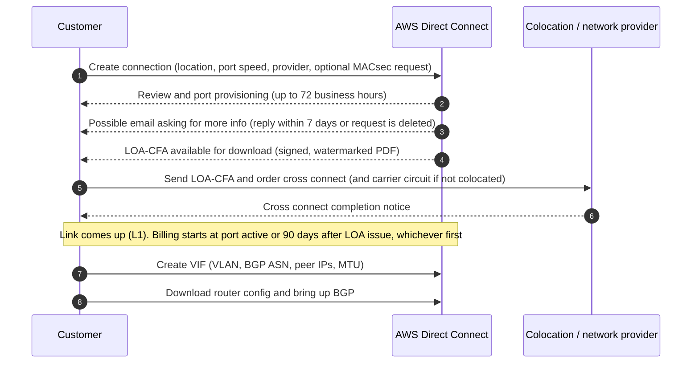
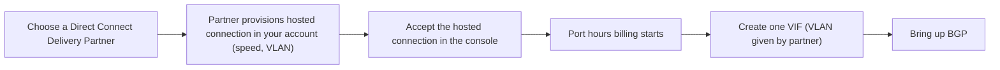
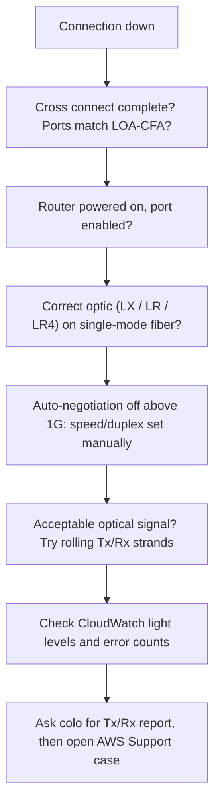

# Direct Connect Connections, Locations, and Ordering

This page covers the physical and connection layer of AWS Direct Connect: dedicated vs hosted connections, hosted connections vs hosted VIFs, Direct Connect locations and how they map to Regions, the LOA-CFA and cross connect workflow with its timelines, physical requirements (optics, fiber, auto-negotiation, VLANs, BGP, BFD, MTU), and the quotas that apply to connections. Verified against AWS documentation as of 2026-09-30.

## Connection types

| Type | Speeds | Who orders it | Physical port | VIFs per connection |
| --- | --- | --- | --- | --- |
| Dedicated connection | 1, 10, 100, 400 Gbps | You, via console, CLI, API (or a partner on your behalf) | Single customer's physical Ethernet port on an AWS DX router | Up to 50 private/public + up to 4 transit, 51 total |
| Hosted connection | 50, 100, 200, 300, 400, 500 Mbps; 1, 2, 5, 10, 25 Gbps | An AWS Direct Connect Delivery Partner provisions it; you accept it | Capacity carved out of the partner's interconnect | 1 (private, public, or transit) |

### Dedicated connections

- Port speed is fixed at order time. To change it, create and configure a new connection.
- Order through the Connection wizard (Resiliency Toolkit, recommended for first-time setups) or Classic (one connection at a time).
- A connection created in a LAG inherits the LAG's port speed and location.
- The network provider that builds the circuit to the location does not have to be an AWS Direct Connect Partner.
- MACsec is available on 10, 100, and 400 Gbps dedicated connections at select locations (see [03-lag-and-macsec.md](03-lag-and-macsec.md)).
- VIF Rate Limiters (June 2026) are supported only on dedicated connections: up to 10 rate limiters per connection (quota adjustable), bandwidth steps from 50 Mbps up to 1.6 Tbps depending on the connection or LAG capacity.

### Hosted connections

- You cannot request a hosted connection in the Direct Connect console. A partner creates it, it appears under **Connections**, and you must **Accept** it before creating a VIF.
- Only partners who meet specific requirements can create 1, 2, 5, 10, or 25 Gbps hosted connections.
- 25 Gbps hosted connections were announced 2024-04-24 and exist only at locations where 100 Gbps ports are available. Before that, the hosted maximum was 10 Gbps.
- Only the partner can change the speed. If the partner supports upgrade/downgrade, you do not need to delete and recreate the connection.
- AWS polices traffic on hosted connections: traffic above the configured rate is dropped, so bursty traffic can see lower throughput than smooth traffic.
- Jumbo frames work only if they were enabled on the partner's parent connection.
- MACsec is not supported on hosted connections (the partner's interconnect can use MACsec, see below).
- Billing: port hours start once you accept the hosted connection.

### Hosted connection vs hosted VIF

| Aspect | Hosted connection | Hosted VIF |
| --- | --- | --- |
| What you get | A connection with its own AWS-enforced capacity (policed) | A VIF on someone else's connection (another account's dedicated connection or a partner link) |
| Capacity | Fixed purchased bandwidth, 50 Mbps to 25 Gbps | No capacity assigned by AWS; shares all available capacity of the owner's link |
| Oversubscription risk | Low, AWS polices per connection | Possible, AWS does not limit per-VIF traffic |
| Status for partners | Recommended model | AWS no longer allows new partner service integrations using hosted VIFs |
| Typical use | Sub-1G to 25G access via a partner | Sharing your own dedicated connection with another of your accounts |

A hosted VIF works like a standard VIF: the other account must accept it, and it can be private, public, or transit. Transit VIFs work on dedicated or hosted connections of any speed.

### Partner interconnects

Direct Connect Delivery Partners own *interconnects* (physical connections or LAGs) from which they carve hosted connections. Since July 2025, partners can enable MACsec on supported 10 Gbps and 100 Gbps interconnects at over 100 PoPs, encrypting the link between their edge device and the AWS device.

## Direct Connect locations

A Direct Connect location is a colocation facility (for example Equinix, CoreSite, Digital Realty, AT Tokyo) where AWS operates DX routers. AWS What's New posts in 2026 cite "over 150" locations worldwide.

### How locations map to Regions

- Each location is associated with one "home" AWS Region; the cross connect tables in the User Guide are grouped by that Region (for example Equinix TY2 under Asia Pacific (Tokyo)).
- From any location in a public Region or GovCloud (US) you can reach public services in every other public Region with a public VIF, and VPCs in any public Region with a Direct Connect gateway. China (Beijing, Ningxia) is excluded.
- Data transfer out of a remote Region is billed at that remote Region's DX data transfer rate.
- AWS advises choosing the location and Region closest to your on-premises infrastructure to minimize cost, management overhead, and latency.
- Some locations are campuses (for example "Equinix DC1-DC6 & DC10-DC11"). You can cross connect from any building of the campus, but a campus counts as one location for resiliency.
- Some locations have meet-me rooms on multiple floors; the console then offers a **Sub Location** (floor) choice.

### Speeds per location

The locations page lists each site's speeds in an "Available as" column and marks MACsec support per speed with "(M)". Examples as of 2026-09-30:

| Location | Available as |
| --- | --- |
| Equinix DC2/DC11, Ashburn, VA | 1G, 10G (M), 100G (M), 400G (M) |
| Equinix CH2, Chicago, IL | 1G, 10G (M), 100G (M), 400G (M) |
| CoreSite VA1, Reston, VA | 1G, 10G (M), 100G (M), 400G (M) |
| Equinix SV5, San Jose, CA | 1G, 10G (M), 100G (M), 400G (M) |
| Digital Realty SEA10, Seattle, WA | 1G, 10G (M), 100G (M), 400G (M) |
| Equinix TY2, Tokyo | 1G, 10G (M), 100G (M) |
| AT Tokyo CC1 Chuo Data Center, Tokyo | 1G, 10G (M), 100G (M) |
| NEC Inzai, Inzai | 1G, 10G (M), 100G (M) |
| Equinix OS1, Osaka | 1G, 10G (M), 100G (M) |
| Telehouse Osaka 2, Osaka | 1G, 10G (M), 100G (M) |

The 400G sites listed on the locations page are all in the United States: CoreSite CH1 and Equinix CH2 (Chicago), 165 Halsey Street (Newark), CoreSite VA1 (Reston), Equinix DC2/DC11 (Ashburn), Equinix DA2 (Dallas), CoreSite SV4 (Santa Clara), Equinix SV5 (San Jose), EdgeConneX PHX01 (Phoenix), and Digital Realty SEA10 (Seattle).

### Recent location launches and expansions

| Date | Location | Speeds |
| --- | --- | --- |
| 2025-01 | Equinix MX1, Querétaro, Mexico (new) plus MACsec at KIO Networks Querétaro | 10G, 100G with MACsec |
| 2025-06 | Chief Telecom HD, Taipei (third in Taiwan) | 10G, 100G with MACsec |
| 2025-07 | STT Chennai, India (100G expansion) | 100G with MACsec |
| 2025-08 | Equinix BA1, Barcelona (first in Barcelona) | 10G, 100G with MACsec |
| 2025-09 | Spark Digital MDR, Auckland; EADC NBO1, Nairobi (first in Kenya); Digital Realty MAD3, Madrid; Rack Centre LGS1, Lagos (100G expansion) | 10G, 100G with MACsec |
| 2025-10 | Netrality KC1, Kansas City and ePLDT Makati, Philippines (100G expansions) | 10G, 100G with MACsec |
| 2025-12 | Hanoi, Vietnam (first in Vietnam) | 1G, 10G, 100G; MACsec on 10G/100G |
| 2026-03 | Equinix SY5, Sydney (tenth in Australia) | 10G, 100G with MACsec |
| 2026-04 | Datacom Orbit DH6, Auckland (100G expansion) | 100G with MACsec |
| 2026-07 | Cirion, Lima, Peru (100G expansion, first 100G/MACsec in Peru) | 100G with MACsec |

## Connectivity options to reach a location

| Option | How it works | Who runs BGP with AWS |
| --- | --- | --- |
| Colocated | Your equipment is already in the DX facility; the facility provides a cross connect using your LOA-CFA | Your router |
| Layer 2 extension | A partner extends the port to your site over Metro Ethernet, dark fiber, or wavelength | Your router at your site |
| Layer 3 extension | A partner router in the DX location peers with AWS, then with you (for example over MPLS) | Partner router (you peer with the partner) |
| Hosted connection | Partner provisions capacity on its interconnect | Your router over the partner's L2 service |

## Ordering workflow (dedicated connection)

### Step details and timelines

1. Request the connection in the console (Connection wizard or Classic), CLI (`create-connection`), or API. Provide location, optional sub location, port speed, and service provider.
2. AWS reviews the request and provisions a port. This can take up to 72 business hours. If you get an email asking for more information, reply within 7 days or the connection is deleted.
3. Download the LOA-CFA. It is a digitally signed and watermarked PDF naming the patch panel and strands assigned. If the download link is not enabled after 72 business hours and you got no email, contact AWS Support.
4. Give the LOA-CFA to your colocation provider (if you have equipment there, you must be their customer) or to your partner/network provider, who orders the cross connect. You cannot order a cross connect yourself at a location where you have no equipment.
5. The LOA-CFA authority expires if the cross connect is not completed within 90 days; download it again to renew.
6. Billing starts when the port is active or 90 days after the LOA is issued, whichever comes first. Delete the port before activation or within those 90 days to avoid charges. If the connection is still not up after 90 days, AWS emails that the port will be deleted in 10 days.
7. Once the link is up, create VIFs, download the router configuration, and verify BGP.

For LAGs, you download one LOA-CFA per new physical connection.

### Hosted connection workflow

## Physical and link requirements

| Requirement | Value |
| --- | --- |
| Fiber | Single-mode fiber |
| 1 Gbps optic | 1000BASE-LX (1310 nm) |
| 10 Gbps optic | 10GBASE-LR (1310 nm) |
| 100 Gbps optic | 100GBASE-LR4 |
| 400 Gbps optic | 400GBASE-LR4 |
| Auto-negotiation | Must be disabled for ports faster than 1 Gbps; for 1 Gbps it may need to be enabled or disabled depending on the AWS endpoint. If disabled, set speed and full duplex manually |
| VLAN | 802.1Q encapsulation must be supported end to end, including intermediate devices; VLAN IDs 1 to 4094, not modifiable after VIF creation |
| Routing | BGP with MD5 authentication is required |
| BFD | Optional; asynchronous BFD is enabled on the AWS side of every VIF and takes effect once you configure it on your router |
| IP | IPv4 and IPv6 (dual-stack BGP per VIF) |
| Frame size | 1522 or 9023 bytes at the link layer (14 B Ethernet header + 4 B VLAN tag + IP datagram + 4 B FCS) |
| MACsec (optional) | MACsec-capable device on your side, see [03-lag-and-macsec.md](03-lag-and-macsec.md) |

### MTU

| VIF type | Standard MTU | Jumbo MTU |
| --- | --- | --- |
| Private VIF | 1500 | 9001 |
| Transit VIF | 1500 | 8500 |
| Public VIF | 1500 | Not offered (the MTU setting is documented only for private and transit VIFs) |

- Enabling jumbo MTU can trigger an update of the underlying connection, which disrupts all VIFs on it for up to 30 seconds. Check **Jumbo Frame Capable** on the connection or VIF summary.
- A jumbo VIF can only be associated with a jumbo-capable connection or LAG.
- If two private VIFs advertise the same route with different MTUs, or a Site-to-Site VPN advertises the same route, 1500 is used.
- Jumbo frames on Transit Gateway support only 8500 bytes.

### Optical light levels (CloudWatch)

`ConnectionLightLevelTx` and `ConnectionLightLevelRx` should be within -14.4 to 2.50 dBm for 1 and 10 Gbps. For 100 Gbps, keep Tx between -4.3 and 4.5 dBm and Rx between -10.6 and 4.5 dBm. 100 and 400 Gbps optics have four lanes, each to be checked.

### Layer 1 troubleshooting checklist

## Quotas relevant to connections

| Quota | Value | Adjustable |
| --- | --- | --- |
| Private or public VIFs per dedicated connection | 50 | No |
| Transit VIFs per dedicated connection | 4 | Contact SA/TAM |
| Total VIFs per dedicated connection | 51 | No |
| VIFs per hosted connection | 1 | No |
| Active connections per location per Region per account | 10 | Contact SA/TAM |
| VIFs per LAG | 51 | No |
| Dedicated connections per LAG | 4 below 100G; 2 at 100G or 400G | No |
| LAGs per Region | 10 | Contact SA/TAM |
| Rate limiters per dedicated connection | 10 | Yes |
| Routes per BGP session, private/transit VIF (on-premises to AWS) | 100 per family by default; up to 1,000 per family with prefix controls (Aug 2026) | Via prefix controls |
| Routes per BGP session, public VIF | 1,000 | No |

## Sources

- <https://docs.aws.amazon.com/directconnect/latest/UserGuide/Welcome.html>
- <https://docs.aws.amazon.com/directconnect/latest/UserGuide/WorkingWithConnections.html>
- <https://docs.aws.amazon.com/directconnect/latest/UserGuide/dedicated_connection.html>
- <https://docs.aws.amazon.com/directconnect/latest/UserGuide/hosted_connection.html>
- <https://docs.aws.amazon.com/directconnect/latest/UserGuide/hosted-vif.html>
- <https://docs.aws.amazon.com/directconnect/latest/UserGuide/connection_options.html>
- <https://docs.aws.amazon.com/directconnect/latest/UserGuide/toolkit-classic.html>
- <https://docs.aws.amazon.com/directconnect/latest/UserGuide/Colocation.html>
- <https://docs.aws.amazon.com/directconnect/latest/UserGuide/remote_regions.html>
- <https://docs.aws.amazon.com/directconnect/latest/UserGuide/WorkingWithVirtualInterfaces.html>
- <https://docs.aws.amazon.com/directconnect/latest/UserGuide/create-vif.html>
- <https://docs.aws.amazon.com/directconnect/latest/UserGuide/vif-rate-limiters.html>
- <https://docs.aws.amazon.com/directconnect/latest/UserGuide/ts_layer_1.html>
- <https://docs.aws.amazon.com/directconnect/latest/UserGuide/limits.html>
- <https://docs.aws.amazon.com/directconnect/latest/UserGuide/MACsec.html>
- <https://repost.aws/knowledge-center/direct-connect-layer-1-issues>
- <https://aws.amazon.com/directconnect/locations/>
- <https://aws.amazon.com/directconnect/partners/>
- <https://aws.amazon.com/directconnect/faqs/>
- <https://aws.amazon.com/blogs/apn/how-apn-partners-can-engage-with-the-aws-direct-connect-partner-model/>
- <https://aws.amazon.com/about-aws/whats-new/2024/04/aws-direct-connect-gbps-hosted-connection-capacities/>
- <https://aws.amazon.com/about-aws/whats-new/2024/07/aws-direct-connect-native-400-gbps-dedicated-connections-select-locations/>
- <https://aws.amazon.com/about-aws/whats-new/2025/07/aws-direct-connect-extends-macsec-support-partner-interconnects/>
- <https://aws.amazon.com/about-aws/whats-new/2026/06/aws-direct-connect-now-supports-vif-rate-limiters/>
- <https://aws.amazon.com/about-aws/whats-new/2026/08/aws-direct-connect-new-prefix-controls/>
- <https://aws.amazon.com/about-aws/whats-new/2025/01/aws-direct-connect-expansion-queretaro-mexico/>
- <https://aws.amazon.com/about-aws/whats-new/2025/06/aws-direct-connect-location-taipei-republic-of-china/>
- <https://aws.amazon.com/about-aws/whats-new/2025/07/aws-100g-expansion-chennai/>
- <https://aws.amazon.com/about-aws/whats-new/2025/08/aws-direct-connect-barcelona-spain/>
- <https://aws.amazon.com/about-aws/whats-new/2025/09/aws-direct-connect-auckland/>
- <https://aws.amazon.com/about-aws/whats-new/2025/09/aws-direct-connect-nairobi/>
- <https://aws.amazon.com/about-aws/whats-new/2025/09/aws-direct-connect-madrid-mad3/>
- <https://aws.amazon.com/about-aws/whats-new/2025/09/aws-direct-connect-100g-expansion-lagos/>
- <https://aws.amazon.com/about-aws/whats-new/2025/10/aws-direct-connect-100g-expansion-kansas-city/>
- <https://aws.amazon.com/about-aws/whats-new/2025/10/aws-direct-connect-100g-makati-city/>
- <https://aws.amazon.com/about-aws/whats-new/2025/12/aws-direct-connect-hanoi/>
- <https://aws.amazon.com/about-aws/whats-new/2026/03/aws-direct-connect-sydney-sy5/>
- <https://aws.amazon.com/about-aws/whats-new/2026/04/aws-direct-connect-100g-auckland/>
- <https://aws.amazon.com/about-aws/whats-new/2026/07/aws-direct-connect-100g-lima/>
