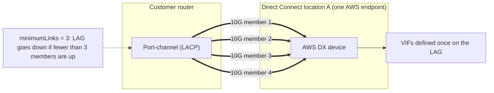
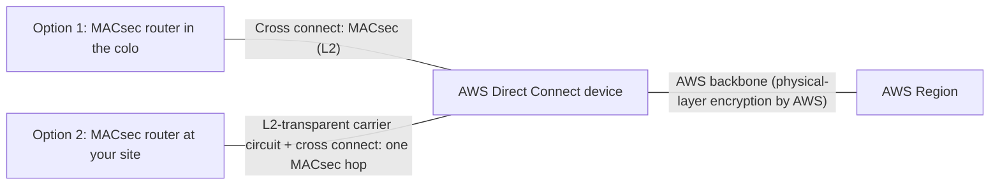
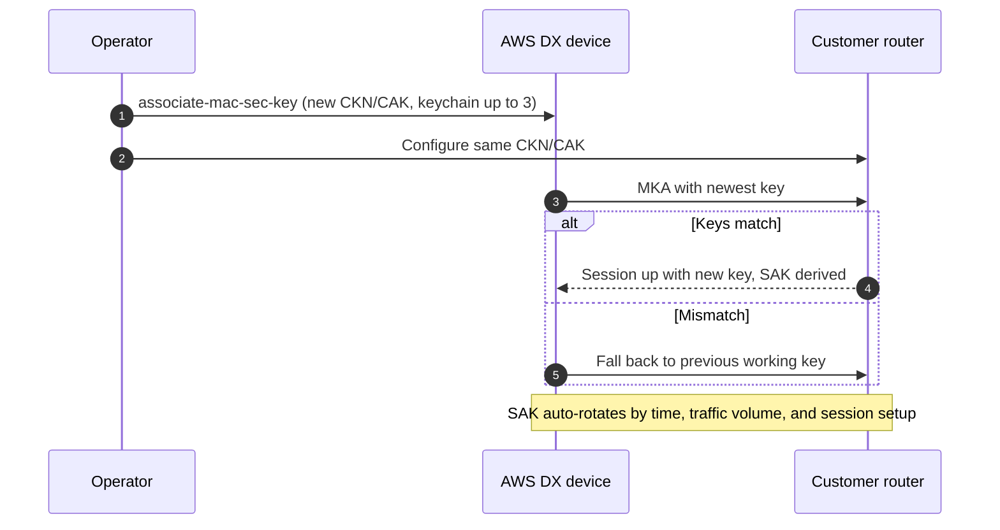

# Direct Connect LAG and MACsec

This page covers link aggregation groups (LAGs) and MAC Security (MACsec) on AWS Direct Connect: LACP behavior, member limits, the minimum-links attribute, MACsec supported speeds and connection types, CKN/CAK keys, cipher suites, encryption modes, key rotation, and how MACsec interacts with LAGs. Verified against AWS documentation as of 2026-09-30.

## Link aggregation groups (LAGs)

A LAG is a logical interface that uses the Link Aggregation Control Protocol (LACP) to aggregate multiple dedicated connections at a single Direct Connect endpoint so you can manage them as one connection. The LAG configuration (VIFs, MACsec key) applies to all members.

### LAG rules

| Rule | Value |
| --- | --- |
| Member type | Dedicated connections only (1, 10, 100, or 400 Gbps) |
| Member speed | All members must use the same bandwidth |
| Max members, below 100G (1G, 10G) | 4 |
| Max members, 100G or 400G | 2 |
| Termination | All members must terminate on the same Direct Connect endpoint (same AWS device, same location) |
| Multi-chassis LAG (MLAG) | Not supported by AWS |
| Forwarding mode | All members operate Active/Active |
| VIF types | Public, private, and transit |
| VIFs per LAG | 51 (up to 4 transit) |
| LAGs per Region | 10 (contact SA/TAM to raise) |
| Connection quota | Each member counts toward the per-Region connection limit |

Maximum aggregate bandwidth therefore is 4 x 1 Gbps = 4 Gbps, 4 x 10 Gbps = 40 Gbps, 2 x 100 Gbps = 200 Gbps, or 2 x 400 Gbps = 800 Gbps per LAG.

### Minimum links attribute

Every LAG has a minimum number of operational connections required for the LAG itself to be operational. New LAGs default to 0. If you set a higher value, the whole LAG goes down when operational members drop below it, which prevents the remaining links from being overloaded and pushes traffic to a redundant path instead.

### LAG operations

- Create a LAG from existing connections or provision new ones. You can later associate standalone connections, or connections from another LAG.
- A connection created for a LAG inherits the LAG's port speed and location.
- You download a separate LOA-CFA for each new physical connection.
- AWS may not be able to guarantee enough free ports on a given endpoint when you create or grow a LAG.
- VIF Rate Limiters are LAG-aware: on a 2 x 1 Gbps LAG you can set limits from 50 Mbps up to 2 Gbps.

## MACsec

MACsec (IEEE 802.1AE) provides data confidentiality, data integrity, and data origin authenticity at Layer 2. On Direct Connect it encrypts the point-to-point link between your MACsec-capable edge device and the AWS Direct Connect device. The two must have direct Layer 2 adjacency, so MACsec is hop-by-hop: it is not end-to-end encryption across multiple network segments. If your router sits in the colo, that hop is just the cross connect, and any carrier circuit from the colo to your site is a separate, unencrypted segment. A carrier circuit is inside the MACsec hop only when your MACsec device is at your end and the carrier passes Ethernet frames through transparently at Layer 2. AWS additionally encrypts data at the physical layer as it flows between Direct Connect locations and AWS Regions.

### Where MACsec is supported

| Connection type | MACsec |
| --- | --- |
| Dedicated 1 Gbps | Not supported |
| Dedicated 10 Gbps | Supported at select locations |
| Dedicated 100 Gbps | Supported at select locations |
| Dedicated 400 Gbps | Supported at select locations |
| LAG | Supported if all members are MACsec-capable dedicated connections of the same speed |
| Partner interconnect | Supported on supported 10G/100G interconnects (since July 2025, 100+ PoPs) |
| Hosted connection | Not supported |

MACsec-capable speeds are marked "(M)" on the Direct Connect locations page. There is no additional charge for MACsec. The connection must be transparent to Layer 2 traffic, and the device terminating the Layer 2 adjacency must support MACsec. If you use a last-mile provider, check with them that the circuit can carry MACsec.

### Timeline

| Date | Change |
| --- | --- |
| 2021-03 | MACsec launched for 10 Gbps and 100 Gbps dedicated connections at select locations |
| 2024-07-01 | 400 Gbps dedicated connections launched (launch post did not mention MACsec) |
| Current docs | MACsec supported on 400 Gbps dedicated connections with GCM-AES-XPN-256; all 400G sites on the locations page show (M) |
| 2025-07 | MACsec extended to partner-owned interconnects |
| 2025 to 2026 | New locations and 100G expansions routinely launch with MACsec on 10G/100G |

### Cipher suites and prerequisites

| Speed | Cipher suites | XPN |
| --- | --- | --- |
| 10 Gbps | GCM-AES-256 or GCM-AES-XPN-256 | Optional |
| 100 Gbps | GCM-AES-XPN-256 | Required |
| 400 Gbps | GCM-AES-XPN-256 | Required |

- Only 256-bit keys (AES-256) are supported.
- Extended Packet Numbering (XPN, IEEE 802.1AEbw-2013) extends the packet number from 32 to 64 bits. Without it, 100G and 400G links would exhaust the packet number space and need key rotation every few minutes.
- Secure Channel Identifier (SCI) must be turned on; it cannot be changed.
- 802.1Q tag offset (dot1q-in-clear) is not supported, so the VLAN tag cannot be moved outside the encrypted payload.
- Request MACsec when creating the connection (`aws directconnect create-connection ... --request-mac-sec`). Check `DescribeConnections` or the console to see whether an existing connection is MACsec-capable.

### Keys: CKN, CAK, and SAK

| Key | Role | Details |
| --- | --- | --- |
| CKN (Connectivity Association Key Name) | Names the pre-shared key | 64 hexadecimal characters; you generate it |
| CAK (Connectivity Association Key) | Pre-shared long-term key | 64 hexadecimal characters (AES-256); you generate it |
| SAK (Secure Association Key) | Session key used to encrypt traffic | Derived automatically from the CKN/CAK at both ends; never pre-shared or stored persistently |

- Only static CAK mode is supported; dynamic CAK mode (802.1X/EAP-based) is not.
- Associate the pair with `associate-mac-sec-key`, either by passing `--ckn` and `--cak` or by referencing an existing AWS Secrets Manager secret with `--secret-arn`. The same pair must be configured on your router.
- AWS stores the CKN/CAK as a Secrets Manager secret encrypted with an AWS managed key. The secret is read-only; you cannot modify an associated key, only disassociate it and associate a new one.
- Scheduling deletion of the secret (7 to 30 days) makes the CKN unreadable. For a pending connection AWS disassociates it; for an available connection AWS emails the owner and disassociates after 30 days without action. If the last CKN is removed while the mode is must_encrypt, AWS switches the mode to should_encrypt to prevent sudden packet loss.
- AWS recommends TLS 1.3 with a post-quantum key exchange such as ML-KEM when sending new CKN/CAK pairs through the console, CLI, or SDK.

### Encryption modes

| Mode | Behavior | Trade-off |
| --- | --- | --- |
| should_encrypt (default for new MACsec connections) | Tries to establish MACsec; falls back to unencrypted traffic if negotiation fails | Higher availability, possible cleartext during failures |
| must_encrypt | Transmits nothing unless MACsec is established | Strongest guarantee, outage if MACsec breaks |

The mode can be set at configuration time and changed later.

### Key rotation

- CKN/CAK (manual): the keychain holds up to three CKN/CAK pairs. Associate a new pair and configure it on your device; the AWS device tries the most recently added key and falls back to the previous working key if it does not match, so rotation is hitless.
- SAK (automatic): rotated by the protocol based on time intervals, volume of encrypted traffic, and session establishment, without disruption.

### MACsec on LAGs

- All LAG members must be MACsec-capable dedicated connections of the same bandwidth; MACsec configuration applies uniformly to every member.
- You can create the LAG and enable MACsec at the same time.
- Only one MACsec key is in use across all LAG links at any time; multiple keys exist only for rotation.
- Creating a LAG from existing connections, or associating a connection with a LAG, removes the connections' own MACsec keys and applies the LAG's key.

## Sources

- <https://docs.aws.amazon.com/directconnect/latest/UserGuide/lags.html>
- <https://docs.aws.amazon.com/directconnect/latest/UserGuide/MACsec.html>
- <https://docs.aws.amazon.com/directconnect/latest/UserGuide/limits.html>
- <https://docs.aws.amazon.com/directconnect/latest/UserGuide/dedicated_connection.html>
- <https://docs.aws.amazon.com/directconnect/latest/UserGuide/vif-rate-limiters.html>
- <https://docs.aws.amazon.com/directconnect/latest/APIReference/API_AssociateMacSecKey.html>
- <https://aws.amazon.com/directconnect/faqs/>
- <https://aws.amazon.com/directconnect/locations/>
- <https://aws.amazon.com/blogs/networking-and-content-delivery/adding-macsec-security-to-aws-direct-connect-connections/>
- <https://aws.amazon.com/about-aws/whats-new/2021/03/aws-direct-connect-announces-macsec-encryption-for-dedicated-10gbps-and-100gbps-connections-at-select-locations/>
- <https://aws.amazon.com/about-aws/whats-new/2024/07/aws-direct-connect-native-400-gbps-dedicated-connections-select-locations/>
- <https://aws.amazon.com/about-aws/whats-new/2025/07/aws-direct-connect-extends-macsec-support-partner-interconnects/>
