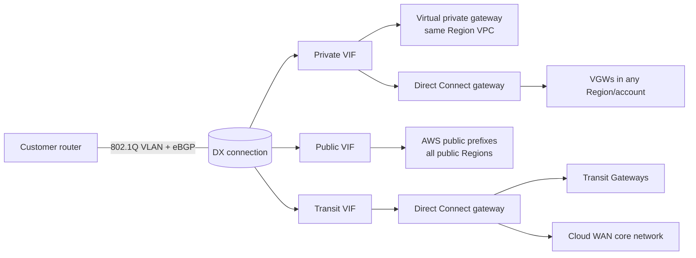
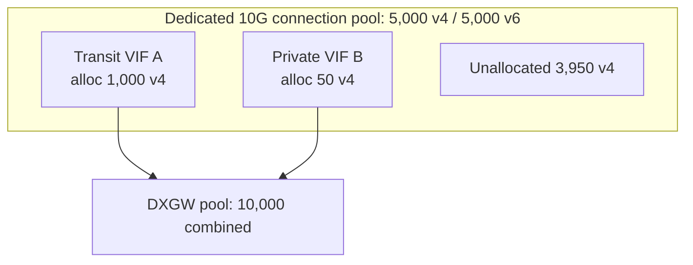

# Virtual Interfaces (VIFs)

A Direct Connect connection is only a Layer 1/Layer 2 pipe. Traffic flows only after you create one or more virtual interfaces (VIFs) on it. Each VIF is an 802.1Q VLAN plus an eBGP session between your router and AWS. There are three types: private (to VPCs), public (to AWS public endpoints), and transit (to Transit Gateways or AWS Cloud WAN through a Direct Connect gateway). This page covers what each type reaches, the BGP and addressing parameters, MTU, hosted VIFs, per-connection limits, and the 2025–2026 changes: 4-byte ASNs, CloudWatch BGP metrics, BGP route visibility, and inbound prefix controls.

_Last verified: 2026-09-30_

## The three VIF types at a glance

| | Private VIF | Public VIF | Transit VIF |
| --- | --- | --- | --- |
| Reaches | VPC private IPs | All AWS public IP prefixes (for example S3, EC2 public IPs, API endpoints), in every public Region | VPCs and VPNs attached to Transit Gateways, or an AWS Cloud WAN core network |
| Attaches to | A virtual private gateway (VGW, same Region only) or a Direct Connect gateway (DXGW) | Nothing (no gateway). A public VIF cannot attach to a DXGW | A DXGW only |
| AWS-side ASN | The VGW ASN (direct attach) or the DXGW ASN | 7224 | The DXGW ASN |
| Peer IPs | Any valid range. AWS can generate private IPv4 | Public IPv4 that you own, or a /31 provided by AWS through a support case | Any valid range |
| Inbound prefix limit (from you) | 100 per address family by default, up to 1,000 with prefix controls (Aug 2026) | 1,000 (cannot be increased) | 100 per address family by default, up to 1,000 with prefix controls |
| Max MTU | 9001 | 1500 | 8500 |
| SiteLink | Yes, only when attached to a DXGW | No | Yes |
| Per dedicated connection | 50 private + public combined | Counted in the 50 | 4 (counted within the total of 51) |

### Private virtual interface

- Used to reach an Amazon VPC with private IP addresses.
- Attached directly to a VGW, a private VIF reaches one VPC in the Region associated with the Direct Connect location.
- Attached to a DXGW, it reaches VGWs in any account and any Region, except the AWS China Regions.
- Jumbo frames (MTU 9001) are supported whether the VIF attaches to a VGW or to a DXGW.

### Public virtual interface

- Reaches all AWS public services on public IP addresses, globally. AWS advertises local and remote Region prefixes plus on-net prefixes from non-Region PoPs such as CloudFront and Route 53.
- You do not reach non-Amazon prefixes. It is not an internet transit service.
- Prefixes announced over BGP can be aggregated or de-aggregated relative to `ip-ranges.json`. BYOIP ranges that you bring to AWS are advertised even though they are not in the JSON file.
- AWS does not re-advertise customer prefixes received on a public VIF outside the AWS network. Those prefixes are visible to all AWS customers, so AWS recommends a firewall filter.
- Accelerated Site-to-Site VPN cannot run over a public VIF.

### Transit virtual interface

- Must attach to a DXGW. That DXGW is then associated with up to 6 Transit Gateways, or with a single AWS Cloud WAN core network segment (native attachment since 2024-11-25).
- Supported on dedicated and hosted connections of any speed.
- MTU 1500 or 8500.
- Transit VIF is the transport for Private IP Site-to-Site VPN over DX (see [06-bgp-and-routing.md](06-bgp-and-routing.md)).

## Parameters required to create a VIF

| Parameter | Detail |
| --- | --- |
| Connection | A dedicated connection, a hosted connection, or a LAG |
| Owner | Your account, or another account ID. That makes it a hosted VIF |
| VLAN | 1–4094, 802.1Q, unique on the connection. It cannot be changed after creation. On hosted connections the Partner provides it |
| Address family | IPv4, IPv6, or both. One BGP session per address family per VIF, so dual-stack means two sessions |
| IPv4 peer IPs | Your IP and the AWS router IP, with the same subnet mask on both. /31 (RFC 3021) is supported on all VIF types |
| IPv6 peer IPs | Amazon always allocates a /125. You cannot choose them |
| Customer ASN | Public (you must own it) or private. 2-byte private range 64512–65534. Long ASNs up to 4,294,967,294 have been supported since 2025 |
| BGP auth | MD5 is always on and cannot be disabled. You supply the key or AWS generates one |
| Prefixes to advertise (public VIF only) | At least 1, at most 1,000. IPv4 /1–/32, IPv6 /1–/64 |
| Jumbo frames (private and transit only) | MTU 1500 by default. 9001 on private VIFs, 8500 on transit VIFs |
| Inbound prefix allocation (private and transit, 2026) | IPv4 and IPv6 allocations, 100 by default, up to 1,000 each |

### ASN rules

- You cannot use the same ASN on the customer side as on the VGW or DXGW side of the same VIF.
- The same customer ASN can be reused across many VIFs.
- Two VIFs can share the same AWS ASN and customer ASN pair if they are on different connections.
- Public VIF AWS-side ASN is 7224. With a private customer ASN, AWS replaces it with 7224 when it propagates your prefixes, so AS_PATH prepending is ineffective. With a public ASN, prepending works as expected.
- AWS verifies ownership of public ASNs.

### Bidirectional Forwarding Detection (BFD)

Asynchronous BFD is automatically enabled on every VIF on the AWS side, but it takes effect only after you configure it on your router.

## MTU and jumbo frames

| VIF type | Allowed MTU | Notes |
| --- | --- | --- |
| Private | 1500 or 9001 | Works when attached to a VGW or a DXGW |
| Transit | 1500 or 8500 | Transit Gateway supports jumbo frames only up to 8500 |
| Public | 1500 | Jumbo frames not supported |

- Enabling jumbo frames can update the underlying connection, which disrupts **all** VIFs on that connection for up to 30 seconds.
- If the same route is learned over VIFs with different MTUs, or also over a Site-to-Site VPN, 1500 is used.
- On hosted connections, jumbo frames are available only if the Partner's parent connection is jumbo-capable.
- Jumbo frames apply only to routes propagated through Direct Connect and to static routes through Transit Gateways.

## Hosted VIFs vs hosted connections

These are different products and are easy to confuse.

| | Hosted VIF | Hosted connection |
| --- | --- | --- |
| What you get | A VIF created by the connection owner, in their dedicated connection, for your account | A sub-rate connection provisioned by a Partner on the Partner's interconnect |
| Acceptance | You accept it (`ConfirmPrivateVirtualInterface`, `ConfirmPublicVirtualInterface`, `ConfirmTransitVirtualInterface`) and pick a VGW or DXGW | You accept the connection |
| VIFs allowed | Not applicable (it is one VIF) | Exactly 1 VIF (private, public, or transit). This cannot be increased |
| Prefix allocation (2026) | Created with the default of 100/100. Only the parent connection owner can change it after acceptance | The customer can set the per-VIF allocation up to 1,000. There is no connection pool |

- A hosted VIF otherwise works the same as a standard VIF.
- Only the connection owner can download the router configuration for a hosted VIF.
- For a hosted public VIF, the owner account is the one billed for data transfer out.

## VIF lifecycle states

`confirming` (waiting for the owner to accept a hosted VIF), `verifying` (public VIFs only), `pending`, `available`, `down` (BGP down), `testing` (during a failover test), `deleting`, `deleted`, `rejected`, and `unknown`.

### Public VIF verification

- Every public VIF is validated before it is provisioned. If a VIF stays in `verifying` for more than 1 hour, AWS automatically opens a support case.
- AWS checks that the ASN is yours (or that you have an LOA), that the peer IPs are valid, that you own the prefixes (or have an LOA on company letterhead), and that the RIR records match the organization on the AWS account.
- LOA review can take up to 3 business days.
- If you advertise prefixes before approval, you must clear the BGP session and re-advertise afterward.
- To add prefixes to an existing public VIF, open an AWS Support case.

## Per-connection and per-VIF quotas

| Quota | Value | Adjustable |
| --- | --- | --- |
| Private + public VIFs per dedicated connection | 50 | No |
| Transit VIFs per dedicated connection | 4 | Contact SA/TAM |
| Total VIFs per dedicated connection or LAG | 51 | No |
| VIFs per hosted connection | 1 | No |
| Inbound routes per BGP session, private or transit VIF | 100 per address family by default, up to 1,000 with prefix controls | Beyond 1,000: SA/TAM, reviewed case by case |
| Inbound routes per BGP session, public VIF | 1,000 | No |
| VIFs per VGW | No limit | – |
| Private or transit VIFs per DXGW | 30 | No |

If you exceed the inbound prefix limit or allocation, the BGP session goes to Idle and reports DOWN. You must withdraw routes and then reset the session.

## Inbound prefix controls (launched 2026-08-20)

Before this launch, a private or transit VIF accepted at most 100 prefixes per address family from on premises. Now each VIF gets an allocation drawn from two pools.

| Limit | Value |
| --- | --- |
| Default allocation per VIF | 100 per address family |
| Max allocation per VIF | 1,000 per address family |
| Pool per dedicated 1G or 10G connection | 5,000 IPv4 + 5,000 IPv6 |
| Pool per dedicated 100G connection | 30,000 + 30,000 |
| Pool per dedicated 400G connection | 50,000 + 50,000 |
| LAG pool | Per-member pool × billable members (up to 4 members for 1G/10G, 2 for 100G/400G) |
| Total allocations per DXGW | 10,000 (IPv4 + IPv6 combined) |
| VIF attachments per DXGW | 30 |

- Pool states are Pool size (fixed by port speed), Allocated, Available (unallocated), and In use (prefixes actually advertised).
- You cannot reduce an allocation below the in-use count. You cannot remove a LAG member if that would shrink the pool below the total allocations.
- Public VIFs are not managed by prefix controls and stay at 1,000.
- A larger allocation does not raise the VPC route table quota for propagated routes (100 per route table, not adjustable). A private VIF on a VGW can still be capped by the VPC.
- AWS Interconnect (multicloud) connections consume 2,000 of a DXGW's 10,000 allocation.
- APIs and fields: `prefixPoolAllocatedCountIpv4` and `prefixPoolAllocatedCountIpv6` on `CreatePrivateVirtualInterface`, `CreateTransitVirtualInterface`, and `UpdateVirtualInterfaceAttributes`. `prefixPoolSizeIpv4` and `prefixPoolUnallocatedCountIpv4` (and the IPv6 equivalents) on `DescribeConnections`. `totalPrefixPoolAllocations` on `DescribeDirectConnectGateways`.
- Available at no extra cost in all commercial Regions, GovCloud (US), and China (Beijing, Ningxia).

## Observability for VIFs (2026)

| Feature | Date | What it gives you |
| --- | --- | --- |
| CloudWatch BGP metrics | 2026-03-30 | `VirtualInterfaceBgpStatus` (1 = UP), `VirtualInterfaceBgpPrefixesAccepted`, and `VirtualInterfaceBgpPrefixesAdvertised` for private, public, and transit VIFs. You can alarm before hitting the prefix limit |
| BGP route visibility | 2026-07-30 | Console tabs for Accepted and Advertised routes, plus the `ListVirtualInterfaceRoutes` API. Shows prefix, address family, AS path, communities (only supported 7224:* values), and route age. Filter by prefix, AS path, community, or address family |
| FIS BGP disruption | 2025-12-18 | AWS Fault Injection Service can disrupt BGP sessions on VIFs to test failover |

## Timeline of VIF-related changes

| Date | Change |
| --- | --- |
| 2016-12-01 | IPv6 BGP peering on VIFs |
| 2018-10-11 | Jumbo frames (9001) on private VIFs |
| 2019-03-27 | Transit VIF with Transit Gateway support |
| 2021-12-01 | SiteLink on private and transit VIFs |
| 2024-07-18 | 400G dedicated connections |
| 2024-11-25 | Transit VIF and DXGW native attachment to AWS Cloud WAN |
| 2025-07-24 / 2025-09-12 | Long (4-byte) ASNs for VIFs (docs update date / What's New date) |
| 2025-12-18 | Resilience testing with AWS FIS (BGP disruption) |
| 2026-03-30 | CloudWatch BGP status and prefix metrics |
| 2026-03 | CloudFormation support for DX resources, including VIFs and BGP peers |
| 2026-07-30 | BGP route visibility (`ListVirtualInterfaceRoutes`) |
| 2026-08-20 | Inbound prefix controls, up to 1,000 prefixes per address family per VIF |

## Sources

- <https://docs.aws.amazon.com/directconnect/latest/UserGuide/WorkingWithVirtualInterfaces.html>
- <https://docs.aws.amazon.com/directconnect/latest/UserGuide/Welcome.html>
- <https://docs.aws.amazon.com/directconnect/latest/UserGuide/hosted-vif.html>
- <https://docs.aws.amazon.com/directconnect/latest/UserGuide/accepthostedvirtualinterface.html>
- <https://docs.aws.amazon.com/directconnect/latest/UserGuide/limits.html>
- <https://docs.aws.amazon.com/directconnect/latest/UserGuide/routing-and-bgp.html>
- <https://docs.aws.amazon.com/directconnect/latest/UserGuide/prefix-controls.html>
- <https://docs.aws.amazon.com/directconnect/latest/UserGuide/prefix-allocations.html>
- <https://docs.aws.amazon.com/directconnect/latest/UserGuide/bgp-route-visibility.html>
- <https://docs.aws.amazon.com/directconnect/latest/UserGuide/AboutThisGuide.html>
- <https://docs.aws.amazon.com/cli/v1/reference/directconnect/confirm-public-virtual-interface.html>
- <https://docs.aws.amazon.com/vpc/latest/userguide/amazon-vpc-limits.html>
- <https://docs.aws.amazon.com/vpn/latest/s2svpn/accelerated-vpn.html>
- <https://repost.aws/knowledge-center/public-vif-stuck-verifying>
- <https://repost.aws/knowledge-center/setup-direct-connect-vif>
- <https://aws.amazon.com/about-aws/whats-new/2026/08/aws-direct-connect-new-prefix-controls/>
- <https://aws.amazon.com/about-aws/whats-new/2026/07/aws-direct-connect-bgp-visibility/>
- <https://aws.amazon.com/about-aws/whats-new/2026/03/aws-direct-connect-cloudwatch-bgp-monitoring/>
- <https://aws.amazon.com/about-aws/whats-new/2026/03/aws-direct-connect-supports-aws-cloudformation/>
- <https://aws.amazon.com/about-aws/whats-new/2025/09/aws-direct-connect-4-byte-autonomous-system-numbers/>
- <https://aws.amazon.com/about-aws/whats-new/2025/12/direct-connect-resilience-testing-fault-injection-service/>
- <https://aws.amazon.com/about-aws/whats-new/2024/11/aws-cloud-wan-on-premises-connectivity-direct-connect/>
