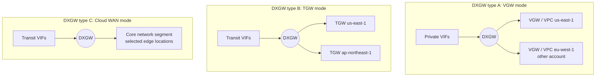
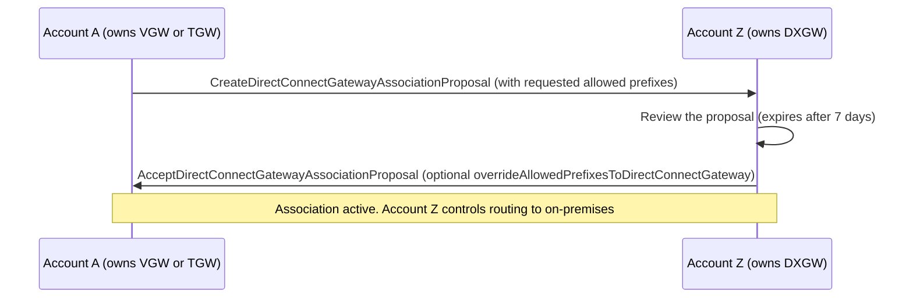
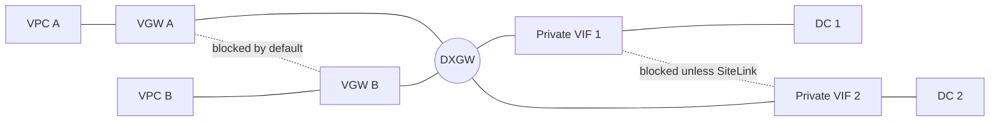
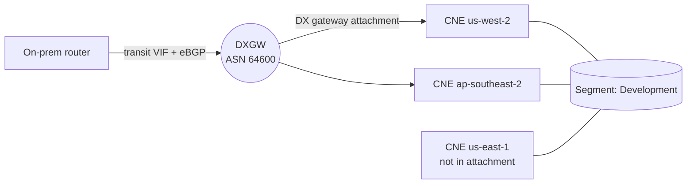
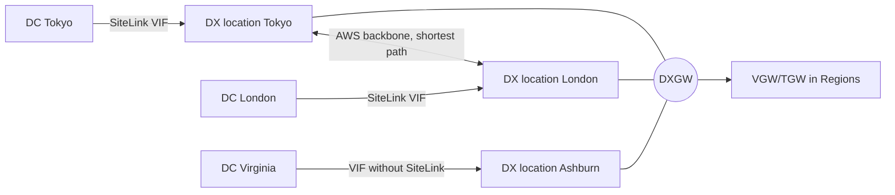

# Direct Connect Gateway, Associations, Cloud WAN, and SiteLink

A Direct Connect gateway (DXGW) is a global, account-level resource that decouples your VIFs from Regions. You attach private or transit VIFs to it, then associate it with virtual private gateways (VGWs), Transit Gateways (TGWs), or one AWS Cloud WAN core network in any Region and in any account, except the China Regions. It acts as a distributed set of BGP route reflectors outside the data path, so a single DXGW has no single point of failure. This page covers association types and their mutual exclusivity, how "allowed prefixes" behave differently for VGW and TGW, cross-account proposals, the non-transitive rules, the Cloud WAN native attachment (2024-11-25), SiteLink, and all DXGW-related quotas, including the 2026 prefix-allocation pool.

_Last verified: 2026-09-30_

## What a DXGW is (and is not)

- It is global. It connects to any public Region and to AWS GovCloud (US), but not to the AWS China Regions.
- It is a control-plane construct, described by AWS as a "distributed set of BGP route reflectors" that "operates outside the data traffic path". High availability is built in, so you do not need multiple DXGWs for redundancy.
- The AWS-side ASN (`amazonSideAsn`) must be private: 64,512–65,534 or 4,200,000,000–4,294,967,294. The default is 64512. In CloudFormation, changing it requires replacement.
- A public VIF cannot attach to a DXGW.
- There is no charge for the DXGW itself. You pay data transfer out based on the source Region and the DX location.

## Association types

| Association target | VIF type used | How many per DXGW | Notes |
| --- | --- | --- | --- |
| Virtual private gateway (VGW) | Private VIF | 20 VGWs (hard limit) | VGW must be attached to a VPC. VPC CIDRs must not overlap |
| Transit Gateway | Transit VIF | 6 TGWs (hard limit) | Use unique ASNs for TGWs in different Regions. A TGW can have up to 20 DXGWs |
| Cloud WAN core network | Transit VIF | 1 core network, 1 segment | Managed only from Network Manager (Cloud WAN) |

The three types are mutually exclusive on a given DXGW:

- You cannot associate a VGW with a DXGW that already has a TGW association.
- You cannot associate a TGW with a DXGW that has a VGW association or an attached private VIF.
- A DXGW attached to a Cloud WAN core network cannot be used for any other association type (VGW, TGW, or private VIF) until it is detached.

A single VGW can also be associated with a DXGW and be attached directly to a private VIF at the same time.

## Allowed prefixes: VGW vs TGW behave differently

This is the most commonly misunderstood DXGW setting.

| | VGW association | TGW association | Cloud WAN attachment |
| --- | --- | --- | --- |
| Role of the list | A filter | The literal advertisement | Not supported |
| What on-prem receives | The VPC CIDR itself, only if an allowed prefix is the same as or wider than the VPC CIDR | Exactly the prefixes in the list, originated from the DXGW ASN, even if no VPC owns them | Every prefix in the segment, with AS_PATH preserved |
| Example: VPC 10.0.0.0/16, list 10.0.0.0/15 | Receives 10.0.0.0/16 | Receives 10.0.0.0/15 | – |
| Example: list 10.0.0.0/24 | Receives nothing (narrower than the VPC) | Receives 10.0.0.0/24 | – |
| Example: list 22.0.0.0/24 | Receives nothing | Receives 22.0.0.0/24 | – |
| Limit | – | 200 prefixes per TGW, IPv4 + IPv6 combined (SA/TAM) | 5,000 prefixes from the core network to on-prem (SA/TAM) |

Other rules:

- Allowed prefixes must not overlap across multiple TGWs on the same DXGW. For example, `0.0.0.0/0` is rejected if another TGW is already associated.
- Adding or removing a prefix affects only traffic that uses that prefix. The association goes from `associated` to `updating` and back, and the BGP session does not reset.
- For Private IP VPN, the TGW CIDR block must appear in the allowed prefixes so that on premises can reach the VPN tunnel outside IPs.
- A `/30` point-to-point VIF address range does not propagate to a TGW.
- VIF inside-network prefixes (the BGP peering subnet) are propagated only to TGWs in other Regions, not within the same Region.

## Cross-account associations (proposals)

- The gateway owner proposes and the DXGW owner accepts. The DXGW owner can override the requested allowed prefixes.
- A VGW proposal expires 7 days after creation. Accepted or deleted proposals remain visible for 3 days.
- For Cloud WAN, sharing is handled through Network Manager ("shared Direct Connect gateway attachment").

## No transitive routing through a DXGW

A DXGW forwards only between VIFs and gateway associations. The following are **not** supported:

- VPC to VPC through the same DXGW, including a hairpin through on-premises over a single DXGW.
- VIF to VIF on the same DXGW. The exception is SiteLink, described below.
- VIF to a Site-to-Site VPN that terminates on a VGW associated with the same DXGW.

There are documented exceptions and caveats:

- **Supernet exception (since November 2021).** If on premises advertises a supernet (for example `10.0.0.0/8` or `0.0.0.0/0`) that covers several VPCs whose VGWs share the same DXGW, and those VPCs use the same VIF, those VPCs can reach each other through the DX endpoint. To prevent this, use security groups, advertise non-overlapping specific routes, or use one DXGW per VPC.
- **TGW case.** VPCs behind TGWs on the same DXGW can communicate. To block this, use TGW route tables with blackhole routes.

## Migrating a VGW-attached VIF to a DXGW

- To reach a VPC in the same Region only, you can attach a private VIF directly to the VGW or use a DXGW. The DXGW path adds multi-Region and multi-account reach.
- Enable VPC route propagation only **after** the VGW is associated with the DXGW. Enabling it earlier can propagate routes incorrectly.
- When a VGW sits behind a DXGW, on premises sees only the DXGW ASN in AS_PATH, not the VGW ASN. The VGW ASN appears only when the VIF attaches directly to the VGW.
- Detaching a VGW from its VPC also disassociates it from the DXGW.

## AWS Cloud WAN native attachment (GA 2024-11-25)

Before November 2024, Cloud WAN reached DX only through an intermediate TGW that was peered with the core network edge (CNE). Now a DXGW attaches directly as a Cloud WAN "Direct Connect gateway attachment".

| Aspect | Behavior |
| --- | --- |
| Management | Created, deleted, and managed only from Network Manager (Cloud WAN). The DX console and API show the association read-only |
| Scope | One core network and one segment per DXGW. Edge locations are "All" (new edges are added automatically) or "Specific" |
| VIF type | Transit VIF |
| Outbound (AWS to on-prem) | Each associated CNE advertises only its local routes to the DXGW. AS_PATH is preserved end to end |
| Inbound (on-prem to AWS) | Learned into the segment route tables of the associated CNEs and routable across all Regions of the segment |
| Allowed prefixes | Not supported. The whole segment is advertised |
| DX BGP communities | Not supported inside Cloud WAN |
| Static routes to the DXGW attachment | Not supported. Routes must be dynamic |
| ASN | The DXGW ASN must be outside the core network ASN range |
| Unsupported with DX as transport | Private IP VPN and Connect attachments |
| Prefix quota | 5,000 prefixes from the core network to on-prem |
| Pricing | Same as other Cloud WAN attachments (per hour plus per GB) |
| Monitoring | CloudWatch Network Monitor latency and loss are supported. Network Health Indicator is not |

Cloud WAN Routing Policy (GA 2025-11-20) adds route filtering, summarization, and BGP attribute manipulation across Cloud WAN attachments. You map policies to attachments with a "routing policy label", which is also offered when you create a DX gateway attachment. This partly compensates for the lack of allowed-prefix lists and DX communities on the Cloud WAN side.

## SiteLink (since 2021-12-01)

SiteLink lets on-premises sites exchange traffic **between Direct Connect locations over the AWS backbone, without going through a Region**. It is the explicit exception to "no VIF-to-VIF transit".

In this example, DC Tokyo and DC London form a full mesh. DC Virginia reaches only the Regions.

| Aspect | Detail |
| --- | --- |
| Supported | Transit VIFs. Private VIFs attached to a DXGW, with or without VGW associations |
| Not supported | Private VIFs attached directly to a VGW. Public VIFs |
| Partitions | Within the same AWS partition. Not available in GovCloud (US) or China |
| Enabling | A flag on a new or existing private or transit VIF (including hosted VIFs). Toggling it flaps that VIF's BGP session |
| Mesh | Full mesh among all SiteLink-enabled VIFs on the same DXGW. A VIF without SiteLink sends its routes only to the gateway associations |
| AS_PATH | The DXGW prepends its ASN once per AWS logical device (ALD) in the path, so remote sites see the DXGW ASN once or twice |
| Same customer ASN everywhere | Remote routes are dropped by loop prevention. Use unique ASNs or `allowas-in` / `local-as ... replace-as` |
| Communities | Standard communities (except 7224:*) and transitive attributes propagate to other SiteLink VIFs |
| Route preference change | With SiteLink, AWS Regions prefer the path with the shortest AS_PATH regardless of the location's associated Region. Without SiteLink, they prefer locations associated with the Region |
| Prefix limit | Up to 1,000 each for IPv4 and IPv6, configured with prefix controls (a separate SiteLink prefix quota was added 2023-06-15) |
| Constraints | Does not work if the same route is advertised on multiple VIFs. No multicast. DSCP is preserved but no QoS is enforced |
| MTU | Up to 8500 or 9001, depending on VIF type |
| Pricing | $0.50 per hour per SiteLink-enabled VIF (charged even when idle), plus per-GB SiteLink data transfer that varies by source and destination. Not covered by the 2026 flat-rate billing tiers |

## DXGW and related quotas

| Quota | Value | Adjustable |
| --- | --- | --- |
| DXGWs per account | 200 | SA/TAM |
| VGWs per DXGW | 20 | No |
| TGWs per DXGW | 6 | No |
| DXGWs per TGW | 20 | No |
| Private or transit VIFs per DXGW | 30 | No |
| Total inbound prefix allocations per DXGW (2026) | 10,000 (IPv4 + IPv6) | – |
| Prefixes from AWS to on-prem per TGW (allowed prefixes) | 200 combined | SA/TAM |
| Prefixes from Cloud WAN core network to on-prem | 5,000 | SA/TAM |
| SiteLink prefixes | Up to 1,000 per address family per VIF | SA/TAM |
| AWS Interconnect (multicloud) cost against the DXGW pool | 2,000 prefixes | – |

## Related: AWS Interconnect (multicloud)

AWS Interconnect (multicloud) connections attach through a DXGW. VGWs and TGWs reach only an Interconnect that is local to their Region. Cloud WAN CNEs can reach any Interconnect attached to the same DXGW globally. Each Interconnect consumes 2,000 of the DXGW's 10,000 prefix allocations. A free 500 Mbps tier was announced in May 2026.

## Sources

- <https://docs.aws.amazon.com/directconnect/latest/UserGuide/direct-connect-gateways-intro.html>
- <https://docs.aws.amazon.com/directconnect/latest/UserGuide/virtualgateways.html>
- <https://docs.aws.amazon.com/directconnect/latest/UserGuide/direct-connect-transit-gateways.html>
- <https://docs.aws.amazon.com/directconnect/latest/UserGuide/allowed-to-prefixes.html>
- <https://docs.aws.amazon.com/directconnect/latest/UserGuide/multi-account-associate-vgw.html>
- <https://docs.aws.amazon.com/directconnect/latest/UserGuide/direct-connect-cloud-wan.html>
- <https://docs.aws.amazon.com/directconnect/latest/UserGuide/WorkingWithVirtualInterfaces.html>
- <https://docs.aws.amazon.com/directconnect/latest/UserGuide/limits.html>
- <https://docs.aws.amazon.com/directconnect/latest/UserGuide/prefix-controls.html>
- <https://docs.aws.amazon.com/directconnect/latest/UserGuide/AboutThisGuide.html>
- <https://docs.aws.amazon.com/directconnect/latest/APIReference/API_CreateDirectConnectGateway.html>
- <https://docs.aws.amazon.com/directconnect/latest/APIReference/API_AcceptDirectConnectGatewayAssociationProposal.html>
- <https://docs.aws.amazon.com/AWSCloudFormation/latest/TemplateReference/aws-resource-directconnect-directconnectgateway.html>
- <https://docs.aws.amazon.com/directconnect/latest/PricingGuide/pricing-flat-rate.html>
- <https://docs.aws.amazon.com/network-manager/latest/cloudwan/cloudwan-dxattach-about.html>
- <https://docs.aws.amazon.com/network-manager/latest/cloudwan/cloudwan-dxattachment-add.html>
- <https://docs.aws.amazon.com/network-manager/latest/cloudwan/cloudwan-dx-share.html>
- <https://docs.aws.amazon.com/interconnect/latest/userguide/what-is-interconnect.html>
- <https://aws.amazon.com/about-aws/whats-new/2024/11/aws-cloud-wan-on-premises-connectivity-direct-connect/>
- <https://aws.amazon.com/about-aws/whats-new/2025/11/aws-cloud-wan-routing-policy/>
- <https://aws.amazon.com/about-aws/whats-new/2026/05/aws-interconnect-multicloud-offers-free-500-mbps-tier/>
- <https://aws.amazon.com/blogs/networking-and-content-delivery/simplify-global-hybrid-connectivity-with-aws-cloud-wan-and-aws-direct-connect-integration/>
- <https://aws.amazon.com/blogs/networking-and-content-delivery/introducing-aws-direct-connect-sitelink/>
- <https://aws.amazon.com/directconnect/pricing/>
- <https://aws.amazon.com/directconnect/pricing/sitelink/>
- <https://aws.amazon.com/cloud-wan/faqs/>
- <https://repost.aws/knowledge-center/direct-connect-vpc-bgp>
- <https://repost.aws/knowledge-center/direct-connect-gateway-association>
- <https://repost.aws/knowledge-center/direct-connect-troubleshoot-sitelink>
