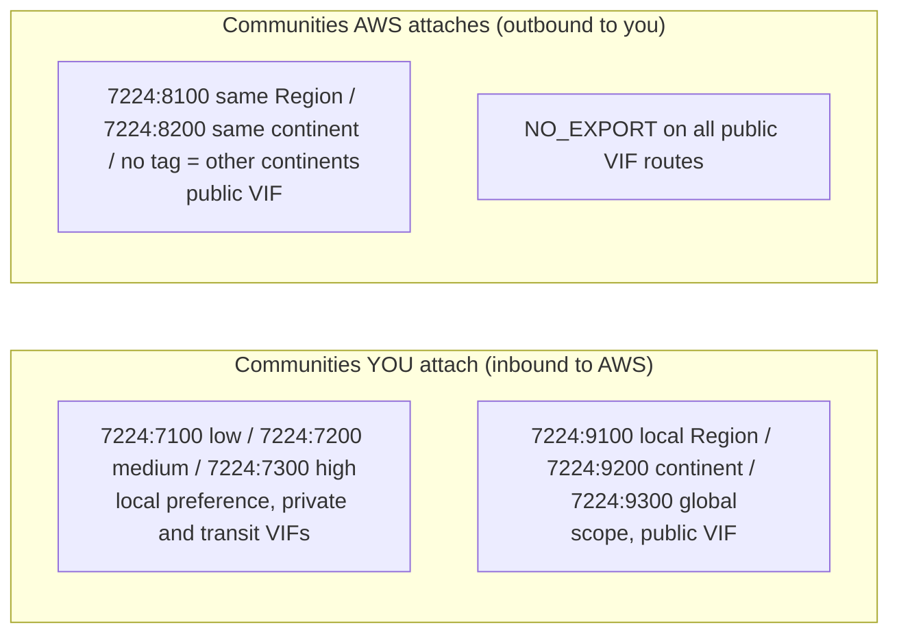
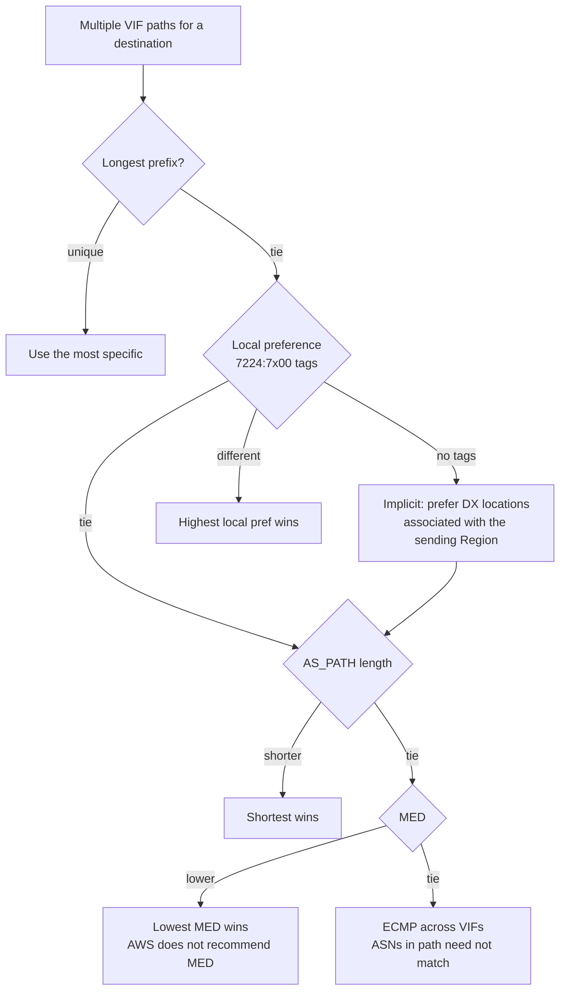
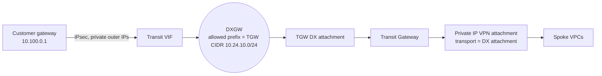

# BGP and Routing over Direct Connect

Every Direct Connect VIF is an eBGP session, and nearly every design decision comes down to how AWS picks a path. That includes active/active or active/passive, DX primary with VPN backup, and Regional scoping of public prefixes. This page covers the public VIF inbound and outbound policies, the full BGP community set (7224:7xxx, 7224:8xxx, 7224:9xxx, NO_EXPORT), AWS path selection on private and transit VIFs, how DX routes compete with VPN routes on a VGW, a Transit Gateway, and in a VPC route table, Private IP VPN over a transit VIF, reaching PrivateLink endpoints over DX, and the route-scale quotas, including the 2026 prefix-control change.

_Last verified: 2026-09-30_

## Route-scale quotas (quick reference)

| Direction | Where | Limit |
| --- | --- | --- |
| On-prem to AWS | Private or transit VIF, per BGP session | 100 per address family by default. Up to 1,000 with inbound prefix controls (since 2026-08-20). Beyond that, contact SA/TAM |
| On-prem to AWS | Public VIF | 1,000 (hard) |
| On-prem to AWS | Sum of VIF allocations per DXGW | 10,000 (IPv4 + IPv6) |
| AWS to on-prem | Per TGW association (allowed prefixes) | 200 combined IPv4 + IPv6 |
| AWS to on-prem | Cloud WAN core network through a DXGW attachment | 5,000 |
| AWS to on-prem | SiteLink | Up to 1,000 per address family per VIF |
| Into a VPC | Propagated routes per VPC route table (VGW) | 100 (not adjustable. AWS says to advertise a default route instead) |
| Comparison | Private IP VPN on a TGW | 1,000 in, 5,000 out |

Exceeding the inbound limit or allocation puts the BGP session in **Idle** (BGP DOWN). Reduce the advertised routes, then clear the session. Since 2026-03-30 you can alarm on `VirtualInterfaceBgpPrefixesAccepted` before that happens.

## Public VIF routing policy

### Inbound (your prefixes to AWS)

- You must own the public prefixes (registered with an RIR) or hold an LOA. AWS verifies them before the VIF becomes available.
- Traffic must be destined for Amazon public prefixes. Transitive routing between connections is not supported.
- AWS applies source-address filtering: packets must come from your advertised prefixes.
- AWS treats every route received on a public VIF as if it carried `NO_EXPORT`. Your prefixes stay inside the AWS network and are never re-advertised to other DX customers, to AWS peers, or to transit providers.
- Customer ASN can be public (verified, full 1–4,294,967,295 range, excluding reserved ranges) or private (64512–65534, 4200000000–4294967294). A private ASN is replaced by 7224, so any prepending on it is stripped.

### Outbound (AWS prefixes to you)

- AWS advertises all local and remote Region prefixes, plus on-net non-Region PoP prefixes such as CloudFront and Route 53. Commercial and China prefixes are advertised only within their own partition.
- AWS advertises with a minimum AS_PATH length of 3 and tags everything with `NO_EXPORT`.
- AWS uses AS_PATH and longest-prefix match to choose the return path. If you advertise the same prefix to the internet and to DX, advertise more specifics over DX.
- If the same prefix is advertised from two Regions over two public VIFs with identical attributes and prefix length, AWS prefers the home Region.
- AWS-advertised prefixes must not leak beyond your network boundary, for example into the public internet table.
- To load-balance across multiple public VIFs, all the VIFs must be in the same Region.

## BGP communities



### Public VIF: scope communities (you set, on your prefixes)

| Community | Propagation of your prefix inside AWS |
| --- | --- |
| `7224:9100` | Local AWS Region only (the Region associated with the DX location) |
| `7224:9200` | All Regions on the same continent (North America, Asia Pacific, or Europe/Middle East/Africa) |
| `7224:9300` | Global, all public Regions |
| No tag | Global (the default) |

Prefixes with the same community and an identical AS_PATH are candidates for multipath. `7224:1` through `7224:65535` are reserved by Direct Connect. Unsupported communities on a public VIF are stripped.

### Public VIF: Region communities (AWS sets, on AWS prefixes)

| Community | Meaning |
| --- | --- |
| `7224:8100` | Prefix originates in the same Region as the DX location |
| `7224:8200` | Prefix originates on the same continent |
| No tag | Other continents |

Filter on these communities if you want only local or continental AWS prefixes. To receive everything, do not filter.

The 2026 BGP route visibility page labels 9xxx as "advertised to your router" and 8xxx as "accepted from your router", which is the reverse of the routing-policies page. The routing-policies page, which matches long-standing AWS behavior and the re:Post guidance, is used here. Confirm against live `ListVirtualInterfaceRoutes` output.

### Private and transit VIF: local preference communities (you set)

| Community | Local preference AWS applies to the path back to you |
| --- | --- |
| `7224:7100` | Low |
| `7224:7200` | Medium. This is also the value AWS applies implicitly to DX locations associated with the same Region when you set no tag |
| `7224:7300` | High |

- These communities are mutually exclusive per prefix and are evaluated **before AS_PATH**.
- Active/active: put the same community (for example `7224:7200`) on all paths. If one path fails, ECMP continues over the remaining paths regardless of home Region.
- Active/passive: `7224:7300` on the primary and `7224:7100` on the backup.
- Not supported inside AWS Cloud WAN (DXGW attachment).

## How AWS chooses a path toward on-prem (private and transit VIFs)



- AWS recommends more-specific prefixes as the primary tool, then local preference communities, then AS_PATH prepending.
- AWS Regions prefer DX locations in their own associated Region. ECMP with no community tags works when there are two or more paths from locations in the same associated Region, or two or more from locations outside it.
- With SiteLink enabled, Regions prefer the shortest AS_PATH regardless of the location's Region.
- This logic governs AWS-to-on-prem traffic only. On-prem-to-AWS load sharing is your router's decision.

### Example: active/passive over two private VIFs

```text
! Primary VIF (DX location A)
route-map TO-AWS-PRIMARY permit 10
 set community 7224:7300
! Backup VIF (DX location B)
route-map TO-AWS-BACKUP permit 10
 set community 7224:7100
! Alternative without communities: prepend on the backup
! route-map TO-AWS-BACKUP permit 10
!  set as-path prepend 65001 65001 65001
router bgp 65001
 neighbor 169.254.10.1 route-map TO-AWS-PRIMARY out
 neighbor 169.254.20.1 route-map TO-AWS-BACKUP out
 neighbor 169.254.10.1 send-community
 neighbor 169.254.20.1 send-community
```

For the inbound direction (AWS to your router), set a higher local preference on routes received over the primary VIF in your own BGP policy.

## DX vs VPN: who wins?

### On a virtual private gateway (same prefix length)

1. BGP routes propagated from Direct Connect
2. Static routes on a Site-to-Site VPN
3. BGP routes propagated from a Site-to-Site VPN
4. Between BGP VPNs: shortest AS_PATH, then lowest MED

Longest-prefix match applies first. So a VPN that advertises a more specific prefix beats DX. VGWs do not support ECMP across VPN tunnels.

### On a Transit Gateway (same CIDR, different attachment types)

1. Static routes
2. Prefix-list-referenced routes
3. VPC-propagated routes
4. **Direct Connect gateway-propagated routes**
5. TGW Connect-propagated routes
6. Site-to-Site VPN over private DX (Private IP VPN) propagated routes
7. Site-to-Site VPN propagated routes
8. VPN Concentrator propagated routes
9. Client VPN propagated routes
10. TGW peering (Cloud WAN) propagated routes

Within one attachment type, the TGW prefers the shorter AS_PATH, then the lower MED, then eBGP over iBGP. Default MED is 0 for DX and 100 for VPN and Connect when none is sent. The TGW route table shows only the active route, so the VPN backup route appears only after the DX route is withdrawn.

### In a VPC route table

- The `local` route always wins, even against a more specific propagated route.
- For an identical destination, static routes (IGW, NAT, ENI, TGW, peering, endpoints, and others) beat routes propagated from the VGW.

## Encryption over DX: Private IP VPN vs other VPN options

| Option | Transport | Endpoints | Notes |
| --- | --- | --- | --- |
| Private IP Site-to-Site VPN (introduced June 2022) | Transit VIF, then DXGW, then TGW | Private IPv4 (RFC 1918 or RFC 6598) on the TGW and the customer gateway | Needs a TGW CIDR block, which you must add to the DXGW allowed prefixes. Outer tunnel IPs are IPv4 only (inner BGP can be IPv6). Acceleration does not apply. Not supported when Cloud WAN uses a DXGW attachment as transport |
| Public IP VPN over a public VIF | Public VIF | AWS public VPN endpoints | Uses public IPs. The accelerated option is **not** supported over a public VIF |
| Accelerated Site-to-Site VPN | Internet, through AWS Global Accelerator | TGW only | Not for DX paths. Uses TGW attachments only |
| MACsec | Physical layer, on dedicated connections | – | Layer 2. See the physical-layer docs |



Private IP VPN lets you run encrypted and unencrypted traffic side by side by using different TGW route tables for the VPN attachment and the DX attachment. Its route scale (1,000 in and 5,000 out) was historically a workaround for the 100-prefix VIF limit. That motivation is weaker since the prefix controls launch in August 2026.

Separately, Site-to-Site VPN added 5 Gbps "Large" tunnels on 2025-11-12, which AWS positions as a backup or overlay for high-capacity DX.

## Reaching PrivateLink and other VPC services over DX

- Interface VPC endpoints (PrivateLink) are reachable from on premises over a private VIF, a transit VIF, or a Cloud WAN attachment, because they are ENIs with private IPs in the VPC. Endpoint-specific DNS names resolve publicly to the private IPs.
- Gateway endpoints (S3, DynamoDB) do **not** route traffic that enters the VPC from DX, VPN, or TGW. On-premises clients must use interface endpoints, or use a public VIF to reach the public service endpoints.
- A public VIF reaches AWS public service endpoints (S3, DynamoDB, API endpoints, and others) directly, without a VPC.

## Operational tooling (2025–2026)

| Date | Feature | Routing relevance |
| --- | --- | --- |
| 2025-09-12 | 4-byte ASN on all VIF types | Use the full RFC 6793 range, up to 4,294,967,294 |
| 2025-11-20 | Cloud WAN Routing Policy | Route filtering, summarization, and BGP attribute control on Cloud WAN, including toward DXGW attachments |
| 2025-12-18 | AWS FIS BGP disruption on VIFs | Test failover to redundant VIFs |
| 2026-03-30 | CloudWatch `VirtualInterfaceBgpStatus`, `...PrefixesAccepted`, `...PrefixesAdvertised` | Alarm before the prefix limit is reached and detect silent route withdrawals |
| 2026-07-30 | BGP route visibility (`ListVirtualInterfaceRoutes`) | See accepted and advertised routes with AS path and communities |
| 2026-08-20 | Inbound prefix controls | Up to 1,000 prefixes per address family per private or transit VIF |

## Sources

- <https://docs.aws.amazon.com/directconnect/latest/UserGuide/routing-and-bgp.html>
- <https://docs.aws.amazon.com/directconnect/latest/UserGuide/limits.html>
- <https://docs.aws.amazon.com/directconnect/latest/UserGuide/prefix-controls.html>
- <https://docs.aws.amazon.com/directconnect/latest/UserGuide/bgp-route-visibility.html>
- <https://docs.aws.amazon.com/directconnect/latest/UserGuide/WorkingWithVirtualInterfaces.html>
- <https://docs.aws.amazon.com/directconnect/latest/UserGuide/allowed-to-prefixes.html>
- <https://docs.aws.amazon.com/directconnect/latest/UserGuide/direct-connect-cloud-wan.html>
- <https://docs.aws.amazon.com/network-manager/latest/cloudwan/cloudwan-dxattach-about.html>
- <https://docs.aws.amazon.com/vpn/latest/s2svpn/vpn-route-priority.html>
- <https://docs.aws.amazon.com/vpc/latest/userguide/route-tables-priority.html>
- <https://docs.aws.amazon.com/vpc/latest/tgw/how-transit-gateways-work.html>
- <https://docs.aws.amazon.com/vpc/latest/userguide/amazon-vpc-limits.html>
- <https://docs.aws.amazon.com/vpn/latest/s2svpn/vpn-limits.html>
- <https://docs.aws.amazon.com/vpn/latest/s2svpn/private-ip-dx.html>
- <https://docs.aws.amazon.com/vpn/latest/s2svpn/private-ip-dx-steps.html>
- <https://docs.aws.amazon.com/vpn/latest/s2svpn/accelerated-vpn.html>
- <https://docs.aws.amazon.com/fsx/latest/ONTAPGuide/configuring-network-access-for-s3-access-points.html>
- <https://docs.aws.amazon.com/amazondynamodb/latest/developerguide/privatelink-interface-endpoints.html>
- <https://aws.amazon.com/privatelink/faqs/>
- <https://aws.amazon.com/vpn/faqs/>
- <https://aws.amazon.com/blogs/networking-and-content-delivery/introducing-aws-site-to-site-vpn-private-ip-vpns/>
- <https://aws.amazon.com/blogs/networking-and-content-delivery/introducing-aws-direct-connect-sitelink/>
- <https://aws.amazon.com/about-aws/whats-new/2026/08/aws-direct-connect-new-prefix-controls/>
- <https://aws.amazon.com/about-aws/whats-new/2026/07/aws-direct-connect-bgp-visibility/>
- <https://aws.amazon.com/about-aws/whats-new/2026/03/aws-direct-connect-cloudwatch-bgp-monitoring/>
- <https://aws.amazon.com/about-aws/whats-new/2025/09/aws-direct-connect-4-byte-autonomous-system-numbers/>
- <https://aws.amazon.com/about-aws/whats-new/2025/11/aws-cloud-wan-routing-policy/>
- <https://aws.amazon.com/about-aws/whats-new/2025/11/aws-site-to-site-vpn-5-gbps-bandwidth-tunnels/>
- <https://aws.amazon.com/about-aws/whats-new/2025/12/direct-connect-resilience-testing-fault-injection-service/>
- <https://repost.aws/knowledge-center/control-routes-direct-connect>
- <https://repost.aws/knowledge-center/direct-connect-gateway-primary-connection>
- <https://repost.aws/knowledge-center/vpn-troubleshoot-accelerated-vpn>
