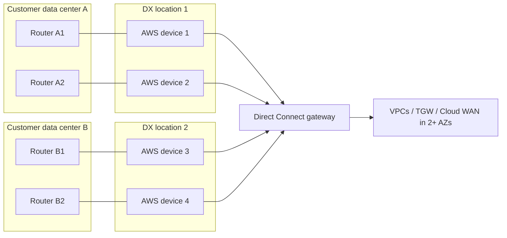
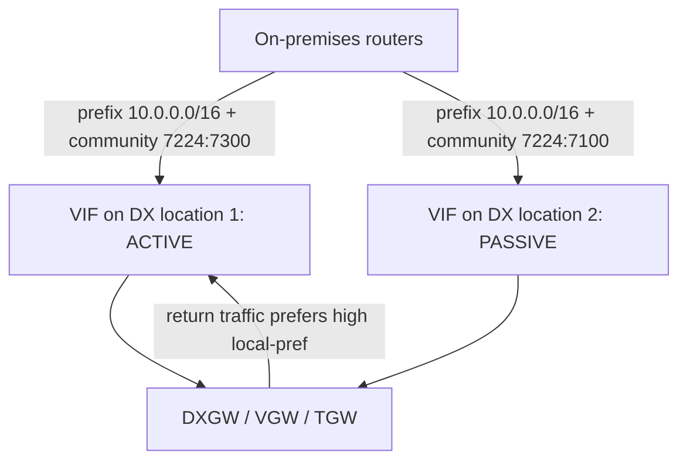
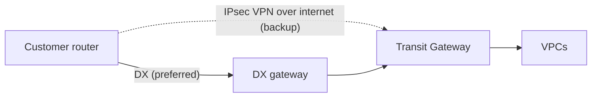

# Resiliency

Direct Connect (DX) is a physical service: a fiber, an optic, a router port, and a building. Any one of them can fail, and AWS also takes DX devices down for maintenance. This page covers the Resiliency Toolkit models, the SLA tiers and what you must build to qualify for them, failover testing, fast failure detection with BFD, active/active versus active/passive routing, and VPN as a backup path.

_Last verified: 2026-09-30. SLA text last updated by AWS on 2026-07-24._

## Why resiliency matters for DX

- A single DX connection is a single point of failure: one cross-connect, one AWS device, one location.
- AWS does planned maintenance on DX devices. It is announced 14 days ahead (reminders at 7 days and 1 day) and runs in a window of up to 4 hours. Emergency maintenance can start right away and usually runs in a 2-hour window. If you have a single connection, your connectivity drops during that window.
- AWS says it "will never schedule a planned maintenance event that will simultaneously take down your redundant connections". During planned maintenance it also drains traffic off the device being worked on, but only when you have a redundant path to drain onto.

## Lesson from the 2021-09-02 Tokyo event

On 2021-09-02 (JST 07:30–13:42), some AWS network devices in one layer between the Direct Connect locations and the Tokyo Region data centers stopped forwarding traffic correctly, but were not removed automatically. Customers saw intermittent connectivity and packet loss on DX traffic into ap-northeast-1 from every location. Site-to-Site VPN (used by some customers as DX backup), internet access to the Region, and DX traffic to other Regions were not affected. The cause was a latent defect in the device operating system triggered by a rare packet signature. Source: <https://aws.amazon.com/message/17908/>.

Takeaways:

- Location diversity protects against a building or device failure, not against a fault inside the AWS network path into one Region.
- Keep a backup of a different kind (Site-to-Site VPN, or DX to another Region) for critical paths.
- Watch for loss and latency (grey failures), not only link and BGP state; Network Synthetic Monitor helps here.

## Resiliency Toolkit models

The Resiliency Toolkit is a connection wizard in the DX console. It orders the right number of dedicated connections, spreads them across devices and locations, and checks that they all have the same speed. It also names the connections, builds LAGs for speeds that are not native port speeds, and shows the SLA you can get plus the port-hour cost.

| Model | Topology | Protects against | SLA target |
| --- | --- | --- | --- |
| Maximum resiliency | 2 or more locations, 2 or more connections per location, each on a separate AWS device (at least 4 connections) | Device failure, fiber cut, complete location failure | 99.99% |
| High resiliency | 1 connection in each of 2 or more locations | Fiber cut, device failure, complete location failure | 99.9% |
| Development and test | 2 connections on separate devices in 1 location | Device failure only (not location failure) | No multi-site SLA |
| Classic (no toolkit) | Whatever you order yourself | Nothing by design | 95% (Single Connection SLA) |



The diagram shows the Maximum resiliency model. High resiliency keeps one connection per location. Development and test keeps two connections in one location.

## SLA tiers and requirements

The DX SLA has three commitments. Service credits are a percentage of the DX port-hour charges for the affected connections.

| SLA | Monthly uptime commitment | Credit 10% | Credit 25% | Credit 100% |
| --- | --- | --- | --- | --- |
| Multi-Site Redundant | 99.99% | below 99.99%, at or above 99.0% | below 99.0%, at or above 95.0% | below 95.0% |
| Multi-Site Non-Redundant | 99.9% | below 99.9%, at or above 99.0% | below 99.0%, at or above 95.0% | below 95.0% |
| Single Connection | 95.0% | below 95.0%, at or above 92.5% | below 92.5%, at or above 90.0% | below 90.0% |

To qualify for the minimum configuration of each deployment type:

| Deployment type | Requirements |
| --- | --- |
| Multi-Site Non-Redundant (99.9%) | At least 2 connections in at least 2 DX locations, all reaching the same endpoint. Enterprise Support plan. For private endpoints, the endpoint is deployed in 2 or more AZs. |
| Multi-Site Redundant (99.99%) | At least 4 connections in at least 2 DX locations, with at least 2 connections per location. Each connection is on a unique AWS device (check the AWS Device ID in the console). Enterprise Support plan and a completed Well-Architected Review with an AWS Solutions Architect. For private endpoints, the endpoint is deployed in 2 or more AZs. |

Key definitions and exclusions:

- "Unavailable" means you completely cannot send or receive data for at least 120 consecutive seconds.
- Ports joined in a LAG count as one "Connection".
- The SLA does **not** cover hosted connections or hosted VIFs provided through a partner. It does cover dedicated connections owned by your account, even when a partner delivers them.
- AWS says it does not recommend any deployment other than Multi-Site Redundant or Multi-Site Non-Redundant for production.
- Credit claims go through the AWS Support Center with the subject "Direct Connect SLA Credit Request". AWS must receive them by the end of the second billing cycle after the incident.

## Failover testing

The Resiliency Toolkit failover test (launched June 2020) makes AWS bring down the BGP session on a VIF you choose. You then check that traffic moves to your redundant VIFs.

| Item | Value |
| --- | --- |
| VIF types | Public, private, transit |
| Who can start it | Only the owner of the account that has the VIF |
| Peering selection | IPv4 or IPv6 BGP peering |
| Duration | Default 180 minutes, maximum 4,320 minutes (72 hours). You can stop it early. |
| After the test | AWS restores BGP with the parameters negotiated before the test |
| CLI | `aws directconnect start-bgp-failover-test` / `stop-bgp-failover-test` / `list-virtual-interface-test-history` |
| Caveat | Do not run it during a DX maintenance window. BGP might come back early. |

```bash
aws directconnect start-bgp-failover-test \
  --virtual-interface-id dxvif-EXAMPLE \
  --bgp-peers <peer-id> \
  --test-duration-in-minutes 60
```

Make the test part of your regular runbook, for example every quarter and after any routing change. It exercises both directions: on-premises to AWS (your router's policy) and AWS to on-premises (the attributes you advertise).

## Fast failure detection: BGP timers and BFD

Without BFD, BGP detects a dead peer only when the hold timer expires. The default is 90 seconds (3 missed keepalives at 30 seconds each).

| Setting | Value |
| --- | --- |
| Default hold timer | 90 s |
| Minimum hold timer | 3 s (0 is not supported) |
| Default keepalive | 30 s |
| Minimum keepalive | 1 s |
| Graceful restart timer | 120 s. Do not use graceful restart and BFD together. |
| BFD minimum liveness interval | 300 ms |
| BFD minimum multiplier | 3 |
| Resulting BFD detection time | about 300 ms × 3 = 900 ms |
| BGP TTL | 1 (no multihop) |

- Asynchronous BFD is enabled automatically on the AWS side of every VIF. It only takes effect after you configure BFD on your router.
- BGP timers negotiate down to the lowest value either side offers. BFD uses the slower of the two sides' intervals, and it negotiates each direction separately.
- AWS recommends enabling BFD and turning graceful restart off so failover is fast.

## Active/active vs active/passive

Routing on DX follows standard BGP best-path selection, with a few AWS-specific controls. Traffic from AWS to on-premises (the AWS side's choice) is evaluated in this order for private and transit VIFs:

1. Longest prefix match. A more-specific prefix always wins.
2. Local preference, which you set with BGP communities `7224:7100` (low), `7224:7200` (medium), `7224:7300` (high). With no community, AWS prefers DX locations associated with the same Region, which it treats as medium.
3. AS_PATH length. Prepend to make a path less preferred.
4. MED. AWS does not recommend relying on it.
5. ECMP across VIFs when all of the above are equal. The ASNs in the AS_PATH do not need to match.

| Pattern | What you advertise from on-premises | Result for AWS to on-premises traffic |
| --- | --- | --- |
| Active/active | Same prefixes, same community (for example `7224:7200`), same AS_PATH length on all VIFs | ECMP per flow across VIFs. If one VIF fails, traffic rebalances across the rest, regardless of home Region. |
| Active/passive (preferred) | Primary VIF tagged `7224:7300`, backup VIF tagged `7224:7100` | All traffic uses the primary. Backup takes over on failure. |
| Active/passive (alternative) | Same prefix with AS_PATH prepends on the backup, or more-specific prefixes on the primary | Works, but local preference communities are evaluated before AS_PATH, so they are the cleaner lever. |

For traffic from on-premises to AWS, your own routers decide. Set local preference (or weight) on your side to match, or you get asymmetric routing.



For public VIFs, AWS picks the outbound path using AS_PATH and longest prefix match. The local preference communities above apply only to private and transit VIFs.

## VPN as a backup

A Site-to-Site VPN over the internet is the cheapest second path. AWS positions it as a valid option when cost matters most, or as a stopgap until you add a second DX.

- **Route preference.** For the same prefix, AWS prefers DX over VPN on both a VGW and a TGW. On a TGW, routes learned from DX have a higher preference than routes learned from VPN. Do not use AS_PATH prepending to demote the VPN, because with equal prefixes the DX route wins no matter how long the prepend is.
- **Asymmetric routing trap.** Advertise the same or less-specific prefixes over VPN than over DX. If the VPN carries more-specific routes (it can: VPN on a TGW accepts more routes than DX), return traffic goes over VPN while the forward path uses DX. Filter or summarize the routes on your customer gateway.
- **Throughput.** Historically each tunnel carried up to 1.25 Gbps, and VGW does not support ECMP across VPN tunnels. That is why AWS's resiliency page does not recommend VPN backup for DX links faster than 1 Gbps unless the VPN terminates on a TGW with ECMP (up to 50 Gbps aggregate).
- **2025 change.** Site-to-Site VPN now supports Large Bandwidth Tunnels of up to 5 Gbps per tunnel on Transit Gateway and Cloud WAN VPN attachments (user guide updated 2025-09-25, What's New posted 2025-11-12). AWS explicitly calls out using them "as a backup or overlay for their high capacity AWS Direct Connect connections".
- **No SLA.** An internet VPN has no end-to-end SLA and its performance varies.



## Multi-Region resiliency

A DX gateway is a global object. From any DX location you can reach VPCs or TGWs in any commercial Region (not China). For Region-level failure, AWS suggests pairing DX gateways with Transit Gateway inter-Region peering. AWS Cloud WAN also attaches DX gateways directly (since 2024-11-25) and can distribute routes across Regions.

## Flat-rate port-pairs (2026)

The flat-rate billing mode launched on 2026-09-15 builds redundancy into the price. A **port-pair** is two dedicated ports on different devices, or in different locations, that share the same speed and pricing tier. The second port is included at no extra charge. Usable capacity equals one port: a 10 Gbps pair gives 10 Gbps, not 20. Pairing across two locations also protects against location failure. See [Pricing](10-pricing.md).

## Checklist

- [ ] At least two DX locations for anything in production.
- [ ] Each connection on a separate AWS device (check the AWS Device ID) and a separate customer router.
- [ ] Ideally two carriers or delivery partners, using diverse paths.
- [ ] Capacity sized so that the surviving links can carry the full load (N+1).
- [ ] BFD enabled and graceful restart disabled.
- [ ] Local preference communities or ECMP chosen on purpose, with a matching policy for traffic from on-premises to AWS.
- [ ] Failover test run regularly.
- [ ] CloudWatch alarms on `ConnectionState` and `VirtualInterfaceBgpStatus` (see [Monitoring](09-monitoring-and-troubleshooting.md)).

## Sources

- Resiliency Toolkit: <https://docs.aws.amazon.com/directconnect/latest/UserGuide/resiliency_toolkit.html>
- DX SLA (last updated 2026-07-24): <https://aws.amazon.com/directconnect/sla/>
- Classic connection (95% SLA): <https://docs.aws.amazon.com/directconnect/latest/UserGuide/classic_connection.html>
- Failover test: <https://docs.aws.amazon.com/directconnect/latest/UserGuide/resiliency_failover.html>
- Knowledge Center, test resiliency (duration limits): <https://repost.aws/knowledge-center/direct-connect-test-resiliency>
- Maintenance: <https://docs.aws.amazon.com/directconnect/latest/UserGuide/dx-maintenance.html>
- BGP settings and BFD: <https://docs.aws.amazon.com/directconnect/latest/UserGuide/bgp-specific-settings.html>
- Knowledge Center, enable BFD: <https://repost.aws/knowledge-center/enable-bfd-direct-connect>
- Routing policies and BGP communities: <https://docs.aws.amazon.com/directconnect/latest/UserGuide/routing-and-bgp.html>
- Active/active and active/passive reference architecture: <https://docs.aws.amazon.com/reference-architecture-diagrams/latest/active-active-and-active-passive-configurations-in-aws-direct-connect/active-active-and-active-passive-configurations-in-aws-direct-connect.html>
- Resiliency recommendations: <https://aws.amazon.com/directconnect/resiliency-recommendation/>
- Hybrid Connectivity whitepaper, reliability: <https://docs.aws.amazon.com/whitepapers/latest/hybrid-connectivity/reliability.html>
- Knowledge Center, asymmetric routing with VPN backup: <https://repost.aws/knowledge-center/direct-connect-asymmetric-routing>
- Site-to-Site VPN 5 Gbps tunnels (2025-11-12): <https://aws.amazon.com/about-aws/whats-new/2025/11/aws-site-to-site-vpn-5-gbps-bandwidth-tunnels>
- Site-to-Site VPN document history: <https://docs.aws.amazon.com/vpn/latest/s2svpn/WhatsNew.html>
- Flat-rate billing and port-pairs: <https://docs.aws.amazon.com/directconnect/latest/UserGuide/flat-rate-connections.html>
