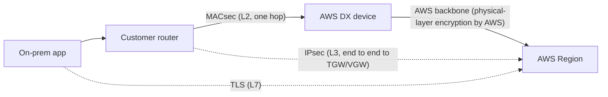
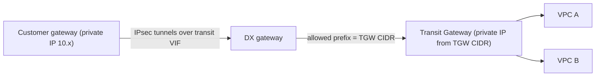

# Security

Direct Connect is private in the sense that it bypasses the public internet, but it is **not encrypted by default**. This page covers encryption options (MACsec at layer 2, IPsec at layer 3), how a public VIF changes your exposure, and the control-plane side: IAM, tagging, and CloudTrail.

_Last verified: 2026-09-30._

## Encryption posture at a glance

AWS states that "AWS Direct Connect does not encrypt your traffic that is in transit by default." Private does not mean encrypted: the cross-connect, partner networks, and the DX device all carry your frames in clear text unless you add encryption.

| Option | Layer | Scope | Connections | Throughput | Notes |
| --- | --- | --- | --- | --- | --- |
| MACsec (IEEE 802.1AE) | L2 | Point-to-point: your router to the AWS DX device | Dedicated 10/100/400 Gbps at select locations, LAGs, partner interconnects | Near line rate | No extra charge. Not available on 1 Gbps dedicated or hosted connections. |
| IPsec VPN over public VIF | L3 | Your router to VGW, TGW, Cloud WAN, or EC2 VPN endpoints | Any DX connection | Per tunnel limits apply | Needs public IPs and a public VIF |
| Private IP VPN over transit VIF | L3 | Your router to Transit Gateway using private IPs | Any DX connection with a transit VIF | Per tunnel limits apply | GA 2022-06-22. No public IPs needed. |
| Self-managed VPN over private VIF | L3 | Your router to your EC2 VPN appliance | Any | Depends on the appliance | You run both ends |
| Application TLS | L7 | End to end | Any | n/a | Always recommended for sensitive data |

AWS also notes that it encrypts all data at the physical layer as it moves across the AWS network between DX locations and Regions. MACsec covers the remaining segment, from your router into the DX location.

## MACsec

- **What it is.** An IEEE 802.1 layer 2 standard that gives confidentiality, integrity, and origin authenticity. It protects everything on the link, including ARP and BGP. It does **not** give end-to-end encryption across several network segments.
- **Keys.** You supply a CKN/CAK pair: a 64-hex-character, 256-bit key. DX supports only **static CAK** mode, not dynamic CAK. The session key (SAK) is derived automatically and rotated based on time, traffic volume, and session setup. You can store up to 3 CKN/CAK pairs, so you can rotate keys without an outage.
- **Key storage.** Your CKN/CAK is stored in AWS Secrets Manager, encrypted with an AWS managed key. If you schedule the secret for deletion and the connection is `must_encrypt`, AWS switches it to `should_encrypt` to avoid sudden packet loss.
- **Cipher suites.** 10 Gbps supports GCM-AES-256 and GCM-AES-XPN-256. 100 and 400 Gbps support only GCM-AES-XPN-256, because extended packet numbering avoids exhausting the packet number space.
- **Modes.**
  - `should_encrypt` is the default. It falls back to clear text if MACsec negotiation fails.
  - `must_encrypt` drops traffic if MACsec is down. It is more secure but less available.
- **Other constraints.** The Secure Channel Identifier (SCI) must be on. Dot1q-in-clear (moving the VLAN tag outside the encrypted payload) is not supported. All links in a LAG share one MACsec key.
- **Key distribution guidance.** AWS recommends TLS 1.3 with a post-quantum key exchange such as ML-KEM when you call `associate-mac-sec-key`.
- **Timeline.** MACsec launched on 2021-03-31 for 10 and 100 Gbps. It was extended to 400 Gbps with the 400G launch in 2024, and to partner-owned interconnects on 2025-07-28. Hosted connections still cannot use MACsec.
- **Monitoring.** Use the CloudWatch metric `ConnectionEncryptionState` (1 = up, 0 = down). On a LAG, 1 means every member link is encrypted.

## IPsec VPN over Direct Connect

### Over a public VIF

A public VIF gives your router reachability to AWS public endpoints, including the public endpoints of Site-to-Site VPN. You then build standard IPsec tunnels to a VGW, TGW, or Cloud WAN core network edge. This was the only managed option before 2022. Its drawbacks: you need public IPs, and you now expose a public VIF (see below).

### Private IP VPN over a transit VIF

- IPsec tunnels run over a transit VIF, through a DX gateway, to a Transit Gateway, using private (RFC 1918 or RFC 6598) outside IPs on both ends.
- You add a TGW CIDR block to the DX gateway's **allowed prefixes** so that your router learns the tunnel endpoint addresses.
- Encrypted and unencrypted traffic can share one DX. Use separate TGW route tables for the VPN attachment and the DX attachment.
- Private IP VPN supports up to 5,000 outbound and 1,000 inbound routes, versus 200 outbound and 100 inbound for a plain DX transit VIF (AWS docs, pre-2026 figures; see the prefix controls note in [Monitoring and troubleshooting](09-monitoring-and-troubleshooting.md)).
- There is no extra TGW data processing charge for a Private IP VPN attachment beyond what the underlying DX attachment already incurs. Site-to-Site VPN connection-hour charges still apply.
- Private IP VPN does not support IPv6 outer tunnel IPs. The "Enable acceleration" option does not apply.

### MACsec or IPsec?

| Requirement | Pick |
| --- | --- |
| 10G+ dedicated, need line-rate encryption, only the last mile is untrusted | MACsec |
| 1 Gbps dedicated or any hosted connection | IPsec (MACsec is not available) |
| Compliance requires end-to-end encryption to the VPC edge | IPsec (Private IP VPN), optionally with MACsec |
| No public IPs allowed | Private IP VPN over transit VIF |
| Defense in depth | MACsec plus TLS, or IPsec plus TLS |

## Public VIF security considerations

- A public VIF receives **all** AWS public prefixes for all public Regions (except China), plus on-net prefixes such as CloudFront and Route 53, unless you filter them. That includes addresses used by other AWS customers, not just your own resources.
- The prefixes you advertise on a public VIF "will be visible to all customers on AWS". Any AWS public IP, including other tenants' EC2 instances, can route back to you over DX. AWS recommends a firewall filter based on source and destination addresses.
- You must own the public prefixes you advertise (they must be registered with an RIR). AWS filters inbound traffic by source and accepts only traffic from your advertised prefixes. Transitive routing is not supported.
- Use scope communities to limit exposure:
  - On your advertisements to AWS: `7224:9100` (local Region), `7224:9200` (continent), `7224:9300` (global, the default).
  - On AWS advertisements to you: `7224:8100` (same Region), `7224:8200` (same continent), no tag (other continents). Filter on these.
- AWS tags every route it advertises with `NO_EXPORT`, and it never re-advertises your public VIF prefixes to the internet or to other DX customers.
- With a private ASN on a public VIF, AWS replaces your ASN with 7224, so your AS_PATH prepends have no effect outside AWS.
- Prefer a private or transit VIF plus VPC endpoints (PrivateLink or gateway endpoints) when you only need a handful of AWS services. It is a smaller attack surface than a public VIF.

## BGP session security

- BGP MD5 authentication is required on the customer device.
- BGP TTL is fixed at 1 (no multihop), so only a directly connected peer can form a session.
- The AWS troubleshooting guide covers GTSM (BGP TTL security) interactions.
- LOA-CFA documents are digitally signed and watermarked, which prevents forged cross-connect orders at colocation facilities.

## IAM, tagging, and audit

| Control | Details |
| --- | --- |
| IAM actions | Service prefix `directconnect:` (for example `CreateConnection`, `CreatePrivateVirtualInterface`, `StartBgpFailoverTest`, `AssociateMacSecKey`). Use least privilege and separate "network admin" and "read-only ops" roles. |
| Tag-based access | Condition keys `aws:RequestTag/${TagKey}`, `aws:ResourceTag/${TagKey}`, `aws:TagKeys`. Tagging has been supported since 2016-11-04. |
| Service-linked role | Used for MACsec, so that DX can read your CKN/CAK secret in Secrets Manager |
| Cross-account | DX gateway association proposals let VPC or TGW owners in other accounts request association. The DXGW owner accepts, and can restrict allowed prefixes. |
| CloudTrail | All DX API actions are logged (supported since 2014-04-04). Watch for `CreateVirtualInterface*`, `AllocateHosted*`, `AcceptDirectConnectGatewayAssociationProposal`, `UpdateDirectConnectGatewayAssociation`, `DeleteConnection`, `StartBgpFailoverTest`. |
| SCPs | Deny `directconnect:Create*`, `directconnect:Allocate*`, and `directconnect:Accept*` outside the network account, so VIFs and DXGWs stay centralized. |

## Security checklist

- [ ] Decide on your encryption requirement explicitly. DX alone does not encrypt.
- [ ] Use MACsec on 10/100/400G dedicated ports where possible, and alarm on `ConnectionEncryptionState`.
- [ ] If you need encryption on 1G or hosted connections, use Private IP VPN over a transit VIF.
- [ ] If you have a public VIF: firewall it, filter by scope community, and advertise only the prefixes you must.
- [ ] Restrict DX gateway allowed prefixes to what each VPC or TGW really needs.
- [ ] Centralize DX in a network account. Use SCPs plus tag-based IAM.
- [ ] Send CloudTrail to a central log account and alert on VIF or DXGW association changes.

## Sources

- Encryption in transit: <https://docs.aws.amazon.com/directconnect/latest/UserGuide/encryption-in-transit.html>
- MACsec: <https://docs.aws.amazon.com/directconnect/latest/UserGuide/MACsec.html>
- MACsec launch (2021-03-31): <https://aws.amazon.com/about-aws/whats-new/2021/03/aws-direct-connect-announces-macsec-encryption-for-dedicated-10gbps-and-100gbps-connections-at-select-locations/>
- MACsec on partner interconnects (2025-07-28): <https://aws.amazon.com/about-aws/whats-new/2025/07/aws-direct-connect-extends-macsec-support-partner-interconnects/>
- Well-Architected Hybrid Networking Lens, DX and IPsec: <https://docs.aws.amazon.com/wellarchitected/latest/hybrid-networking-lens/aws-direct-connect-and-ipsec-vpn.html>
- Private IP VPN with DX: <https://docs.aws.amazon.com/vpn/latest/s2svpn/private-ip-dx.html>
- Private IP VPN setup: <https://docs.aws.amazon.com/vpn/latest/s2svpn/private-ip-dx-steps.html>
- Private IP VPN announcement (2022-06-22): <https://aws.amazon.com/about-aws/whats-new/2022/06/aws-site-vpn-introduces-private-ip-security-privacy>
- Blog, Introducing Private IP VPNs: <https://aws.amazon.com/blogs/networking-and-content-delivery/introducing-aws-site-to-site-vpn-private-ip-vpns>
- Knowledge Center, encrypted connection over DX: <https://repost.aws/knowledge-center/create-vpn-direct-connect>
- Virtual interfaces and public VIF prefix rules: <https://docs.aws.amazon.com/directconnect/latest/UserGuide/WorkingWithVirtualInterfaces.html>
- Routing policies and BGP communities: <https://docs.aws.amazon.com/directconnect/latest/UserGuide/routing-and-bgp.html>
- Knowledge Center, BGP communities on public VIF: <https://repost.aws/knowledge-center/control-routes-direct-connect>
- Dedicated connections and LOA-CFA: <https://docs.aws.amazon.com/directconnect/latest/UserGuide/dedicated_connection.html>
- IAM condition keys: <https://docs.aws.amazon.com/service-authorization/latest/reference/list_directconnect.html>
- Tag-based policy examples: <https://docs.aws.amazon.com/directconnect/latest/UserGuide/security_iam_resource-based-policy-examples.html>
- CloudTrail logging: <https://docs.aws.amazon.com/directconnect/latest/UserGuide/logging_dc_api_calls.html>
- Transit Gateway pricing (Private IP VPN data processing note): <https://aws.amazon.com/transit-gateway/pricing/>
- DX document history: <https://docs.aws.amazon.com/directconnect/latest/UserGuide/AboutThisGuide.html>
