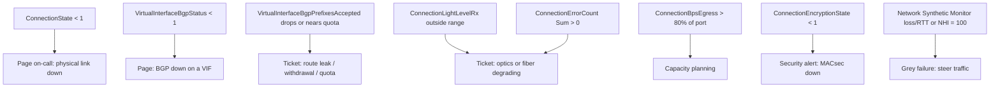
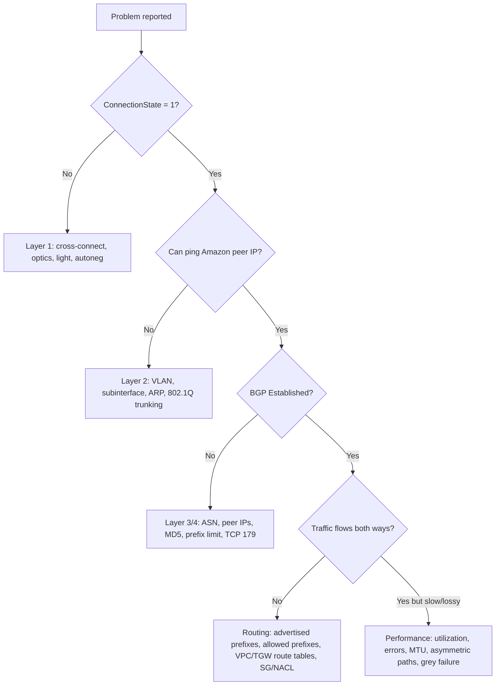

# Monitoring and troubleshooting

This page covers what to watch on a Direct Connect deployment: CloudWatch metrics, the BGP metrics added in 2026, BGP route visibility, VIF rate limiter metrics, Network Synthetic Monitor, AWS Health maintenance notices, and CloudTrail. It then walks through the layer 1, layer 2, layer 3, and routing troubleshooting flow.

_Last verified: 2026-09-30._

## Observability stack

| Tool | What it tells you | Since |
| --- | --- | --- |
| CloudWatch metrics (namespace `AWS/DX`) | Port state, optics, errors, throughput, encryption, VIF traffic, BGP state and prefix counts | Connection metrics 2017-06-29; VIF metrics 2020-05-11; BGP metrics 2026-03-30 |
| BGP route visibility (`ListVirtualInterfaceRoutes`) | Routes AWS accepted from you and routes AWS advertises to you, with AS_PATH, communities, and install time | 2026-07-30 |
| VIF rate limiter metrics | Per-VIF utilization percentage and policed (dropped) traffic | 2026-06-01 |
| CloudWatch Network Synthetic Monitor | Round-trip time and packet loss from a VPC subnet to on-premises IPs over DX or VPN, plus the AWS Network Health Indicator | GA 2023-12 (as "Network Monitor", renamed 2024) |
| AWS Health and User Notifications | Planned and emergency maintenance events | Ongoing. Email delivery moved to AWS User Notifications on 2025-12-25. |
| CloudTrail | Who changed what (connections, VIFs, DXGW associations, failover tests) | 2014-04-04 |

## CloudWatch metrics

By default, data arrives every 5 minutes. Each data point aggregates at least two samples. You can request 1-minute periods, but AWS does not guarantee resolution better than 5 minutes.

### Connection metrics

| Metric | Meaning | Alarm idea |
| --- | --- | --- |
| `ConnectionState` | 1 = up, 0 = down. Available for dedicated and hosted connections, and also visible in hosted VIF owner accounts. | Minimum < 1 for 1 datapoint |
| `ConnectionBpsEgress` / `ConnectionBpsIngress` | Bitrate out of AWS / into AWS | Over 70–80% of port speed sustained. Size for N+1. |
| `ConnectionPpsEgress` / `ConnectionPpsIngress` | Packet rate | Baseline anomaly detection |
| `ConnectionErrorCount` | MAC-level errors, including CRC, since the last datapoint (use the Sum statistic). Replaces the retired `ConnectionCRCErrorCount`. | Sum > 0 |
| `ConnectionLightLevelTx` / `ConnectionLightLevelRx` | Optical power in dBm, with the `OpticalLaneNumber` dimension (100G has 4 lanes) | Outside the healthy range (see below) |
| `ConnectionEncryptionState` | MACsec: 1 = up, 0 = down. On a LAG, 1 means all members are encrypted. | < 1 when `must_encrypt` is expected |
| `ConnectionDiscardsPpsEgress` | Packets dropped on egress (buffer overflow, congestion) | > 0 sustained |

Healthy light levels, according to the AWS Knowledge Center:

- 1G and 10G: between -14.4 dBm and 2.50 dBm.
- 100G: Tx from -4.3 to 4.5 dBm and Rx from -10.6 to 4.5 dBm, on each of the 4 lanes.

### Virtual interface metrics

| Metric | Meaning |
| --- | --- |
| `VirtualInterfaceBpsEgress` / `VirtualInterfaceBpsIngress` | VIF bitrate. On a hosted connection this is your best estimate of total usage. |
| `VirtualInterfacePpsEgress` / `VirtualInterfacePpsIngress` | VIF packet rate |
| `VirtualInterfaceBgpStatus` | BGP session state: 1 = up, 0 = down. Dimension `IpAddressFamily` = `ipv4` or `ipv6`. |
| `VirtualInterfaceBgpPrefixesAccepted` | Number of prefixes AWS accepted from your router |
| `VirtualInterfaceBgpPrefixesAdvertised` | Number of prefixes AWS advertises to your router |

The three BGP metrics launched on 2026-03-30 for private, public, and transit VIFs in all commercial Regions. Before that, you had to poll the API or build a Lambda function to get BGP state.

### VIF rate limiter metrics (dedicated connections only)

| Metric | Meaning |
| --- | --- |
| `VirtualInterfaceUtilizationIngress` / `VirtualInterfaceUtilizationEgress` | Utilization as a percentage of the configured rate limit. It is measured before policing, so it can exceed 100%. |
| `VirtualInterfacePolicedPpsIngress` / `VirtualInterfacePolicedPpsEgress` | Packets per second dropped by the limiter |
| `VirtualInterfacePolicedBpsIngress` / `VirtualInterfacePolicedBpsEgress` | Traffic dropped by the limiter |

Rate limiters (launched 2026-06-01) cap one VIF so it cannot starve the others ("noisy neighbor").

- Up to 10 per dedicated connection by default.
- Limits from 50 Mbps up to 1.6 Tbps (on a large LAG). Supported on private, public, and transit VIFs.
- Egress is always enforced on the device that applies the limit. Ingress may be enforced only after your traffic has already crossed the physical port, so police traffic on your own router as well.

### Recommended alarm set

## BGP route visibility (2026)

Since 2026-07-30 you can view, per VIF in the console or through the `ListVirtualInterfaceRoutes` API:

- **Accepted routes**: what AWS received from your router.
- **Advertised routes**: what AWS sends to your router.

Each route shows its prefix, address family, AS_PATH, communities, and install timestamp. This answers "did AWS actually accept my prefix?" without opening a support case. It is available in all commercial Regions and the China Regions.

## Prefix limits and prefix controls (2026)

| Limit | Value |
| --- | --- |
| Routes from on-premises per BGP session, private or transit VIF | Default 100 each for IPv4 and IPv6. Since 2026-08-20 this can be raised to 1,000 each with inbound prefix controls. |
| Routes per BGP session, public VIF | 1,000 (hard limit) |
| Prefixes per TGW from AWS to on-premises over a transit VIF | 200 combined IPv4 and IPv6 |
| Prefixes a Cloud WAN DXGW attachment advertises to on-premises | 5,000 |
| Propagated routes per VPC route table (from a VGW) | 100 (hard limit) |

If you exceed your allocation, the BGP session goes **idle** and reports `DOWN`. This is the most common cause of a sudden "BGP down" after someone adds routes on premises. Prefix controls draw each VIF's allocation from pools at the dedicated-connection level and at the DX gateway level. Pool size scales with port speed and with the number of LAG members.

## Maintenance notifications

- **Planned maintenance**: announced 14, 7, and 1 calendar days ahead. It runs in a window of up to 4 hours during low-traffic hours at the DX location.
- **Emergency maintenance**: may start immediately and usually runs in a 2-hour window. You get notifications when it starts and when it completes.
- **Hosted connections**: both you and the partner receive the notifications.
- **Third-party (partner or carrier) maintenance**: AWS has no visibility into it. Ask your provider.
- **Where notices arrive**: AWS Health, the Health Dashboard, EventBridge integration, and AWS User Notifications (email delivery moved there on 2025-12-25). Add alternate contacts or distribution lists.
- **No rescheduling**: AWS does not postpone or cancel maintenance for individual customers, because devices are shared.

Route AWS Health events to EventBridge, then to your ticketing system or chat. Before a known window, you can shift traffic proactively with local preference communities.

## CloudWatch Network Synthetic Monitor

This tool catches **grey failures**: BGP stays up but the path loses packets or its latency spikes.

- You define probes by source subnet, on-premises destination IP, protocol (ICMP or TCP), port, and packet size. AWS runs the probe agents for you.
- It publishes RTT and packet loss, plus a Network Health Indicator (NHI). NHI = 100 means AWS saw degradation on the AWS-controlled part of the path (VPC to DX location). NHI = 0 means it did not.
- NHI is not accurate for DX attachments routed through Cloud WAN.
- AWS Interconnect (multicloud) free-tier interconnects include a Network Synthetic Monitor at no extra cost.

## CloudTrail

All DX API actions are logged. High-signal events to alert on:

- `DeleteConnection`, `DeleteVirtualInterface`, `DeleteDirectConnectGateway`
- `CreatePrivateVirtualInterface`, `CreatePublicVirtualInterface`, `CreateTransitVirtualInterface`, `AllocateHosted*`
- `CreateDirectConnectGatewayAssociation`, `UpdateDirectConnectGatewayAssociation`, `AcceptDirectConnectGatewayAssociationProposal` (these change allowed prefixes)
- `StartBgpFailoverTest`, `AssociateMacSecKey`, `DisassociateMacSecKey`

## Troubleshooting flow

### Layer 1: physical connection down

1. Confirm the colocation provider has completed the cross-connect, and compare the ports on the completion notice with your LOA-CFA.
2. Check that your router, or your provider's router, is powered on and the port is enabled.
3. Check the optic type:
   - 1000BASE-LX for 1G.
   - 10GBASE-LR for 10G.
   - 100GBASE-LR4 for 100G.
   - 400GBASE-LR4 for 400G.
   - All run over single-mode fiber.
4. Set auto-negotiation correctly. Disable it for ports faster than 1 Gbps and set speed and duplex manually. For 1 Gbps, whether to enable it depends on the DX endpoint.
5. Check `ConnectionLightLevelTx` and `ConnectionLightLevelRx` in CloudWatch. Try rolling (swapping) the Tx and Rx fiber strands.
6. Ask the colocation provider for a written Tx/Rx light report, then open an AWS Support case with that report and the completion notice.
7. Remember the billing clock: port-hours start when the port becomes active, or 90 days after the LOA is issued, whichever comes first.

### Layer 2: connection up, VIF down

1. Configure the peer IP on the VLAN subinterface (for example `Gi0/0.123`), not on the physical interface.
2. Check that the VLAN ID matches the VIF.
3. Check that the ARP table on your router has an entry for the AWS peer.
4. Make sure every intermediate device (partner switches included) trunks your 802.1Q tag. AWS cannot resolve ARP until it receives tagged frames.
5. Clear the ARP cache on your side and ask your provider to clear theirs.

### Layer 3/4: BGP not establishing

1. Check your ASN and the Amazon ASN:
   - Public VIF: 7224.
   - Private VIF: the VGW or DXGW ASN.
   - Transit VIF: the DXGW ASN.
   - Long (4-byte) ASNs have been supported since 2025.
2. Check the peer IPs and subnet on both sides.
3. Check that the MD5 key matches exactly (watch for trailing spaces).
4. Check that you are within your prefix allocation. The default is 100 on private and transit VIFs, up to 1,000 with prefix controls. Public VIFs allow 1,000.
5. Make sure no ACL or firewall blocks TCP 179 or ephemeral ports.
6. Check that BGP TTL is 1 and that you are not trying multihop.
7. Read your BGP logs, then open a support case.

### Routing: BGP up, no traffic

1. Confirm that you actually advertise your on-premises prefix. `VirtualInterfaceBgpPrefixesAccepted` and route visibility show what AWS accepted.
2. **Private VIF on a VGW**: the VPC route table needs a route to the VGW, or enable route propagation (up to 100 propagated routes per table).
3. **DXGW to TGW**: the DXGW association's **allowed prefixes** decide what AWS advertises to on-premises. Missing CIDRs there are a classic cause of "on-premises can't reach the new VPC".
4. **TGW**: the DX attachment must be associated with and propagated to the right TGW route tables. VPC route tables must point to the TGW.
5. Security groups and network ACLs must allow the on-premises CIDRs.
6. For a public VIF, you must advertise public prefixes you own. AWS drops traffic whose source is not in your advertised prefixes.

### Asymmetric routing

Symptoms: stateful firewalls drop sessions, or traffic works in one direction only.

| Cause | Fix |
| --- | --- |
| VPN backup advertises more-specific prefixes than DX | Advertise the same or less-specific prefixes over VPN, or filter on the customer gateway |
| On-premises prefers path A while AWS prefers path B | Align local preference on both sides. Use `7224:7300` and `7224:7100` toward AWS and a matching local-pref inside your network. |
| AWS default Region-affinity preference picks an unexpected location | Tag communities explicitly instead of relying on the default |
| Two private VIFs with different MTUs or a VPN for the same route | The effective MTU drops to 1500. Keep MTUs consistent. |

### Performance and MTU

- MTU: 1500 or 9001 on private VIFs, 1500 or 8500 on transit VIFs. Enabling jumbo frames can bounce every VIF on the connection for up to 30 seconds.
- Check `ConnectionBpsEgress` against port speed, `ConnectionErrorCount`, and `ConnectionDiscardsPpsEgress`.
- On hosted connections, compare `VirtualInterfaceBps*` with the purchased capacity. Hosted connections are rate-limited to that capacity.
- Use Network Synthetic Monitor to separate AWS-side from customer-side degradation.

## Sources

- CloudWatch metrics and dimensions: <https://docs.aws.amazon.com/directconnect/latest/UserGuide/monitoring-cloudwatch.html>
- View DX CloudWatch metrics: <https://docs.aws.amazon.com/directconnect/latest/UserGuide/viewing-metrics.html>
- BGP CloudWatch metrics (2026-03-30): <https://aws.amazon.com/about-aws/whats-new/2026/03/aws-direct-connect-cloudwatch-bgp-monitoring/>
- Blog, VIF BGP health and prefix count metrics: <https://aws.amazon.com/blogs/networking-and-content-delivery/introducing-cloudwatch-metrics-for-aws-direct-connect-virtual-interface-bgp-health-and-prefix-count/>
- BGP route visibility (2026-07): <https://aws.amazon.com/about-aws/whats-new/2026/07/aws-direct-connect-bgp-visibility/>
- VIF rate limiters: <https://docs.aws.amazon.com/directconnect/latest/UserGuide/vif-rate-limiters.html>
- VIF rate limiters announcement (2026-06-01): <https://aws.amazon.com/about-aws/whats-new/2026/06/aws-direct-connect-now-supports-vif-rate-limiters/>
- Prefix controls (2026-08-20): <https://aws.amazon.com/about-aws/whats-new/2026/08/aws-direct-connect-new-prefix-controls/>
- Quotas: <https://docs.aws.amazon.com/directconnect/latest/UserGuide/limits.html>
- Maintenance: <https://docs.aws.amazon.com/directconnect/latest/UserGuide/dx-maintenance.html>
- Knowledge Center, maintenance notifications: <https://repost.aws/knowledge-center/get-direct-connect-notifications>
- Network Monitor GA (2023-12): <https://aws.amazon.com/about-aws/whats-new/2023/12/amazon-cloudwatch-network-monitor-generally-available/>
- Blog, Network Synthetic Monitor for hybrid connectivity: <https://aws.amazon.com/blogs/networking-and-content-delivery/monitor-hybrid-connectivity-with-amazon-cloudwatch-network-monitor/>
- How Network Synthetic Monitor works (NHI): <https://docs.aws.amazon.com/AmazonCloudWatch/latest/monitoring/nw-monitor-how-it-works.html>
- AWS Interconnect free 500 Mbps tier (includes Network Synthetic Monitor): <https://aws.amazon.com/about-aws/whats-new/2026/05/aws-interconnect-multicloud-offers-free-500-mbps-tier/>
- CloudTrail: <https://docs.aws.amazon.com/directconnect/latest/UserGuide/logging_dc_api_calls.html>
- Troubleshooting index: <https://docs.aws.amazon.com/directconnect/latest/UserGuide/Troubleshooting.html>
- Layer 1: <https://docs.aws.amazon.com/directconnect/latest/UserGuide/ts_layer_1.html>
- Layer 2: <https://docs.aws.amazon.com/directconnect/latest/UserGuide/ts-layer-2.html>
- Layer 3/4: <https://docs.aws.amazon.com/directconnect/latest/UserGuide/ts-layer-3.html>
- Routing: <https://docs.aws.amazon.com/directconnect/latest/UserGuide/ts-routing.html>
- Knowledge Center, light levels: <https://repost.aws/knowledge-center/direct-connect-txrx-optical-readings>
- Knowledge Center, transit VIF connectivity: <https://repost.aws/knowledge-center/direct-connect-fix-connectivity-to-vpc>
- Knowledge Center, asymmetric routing: <https://repost.aws/knowledge-center/direct-connect-asymmetric-routing>
- MTU and jumbo frames: <https://docs.aws.amazon.com/directconnect/latest/UserGuide/WorkingWithVirtualInterfaces.html>
- Dedicated connections (LOA-CFA and billing start): <https://docs.aws.amazon.com/directconnect/latest/UserGuide/dedicated_connection.html>
- DX document history: <https://docs.aws.amazon.com/directconnect/latest/UserGuide/AboutThisGuide.html>
