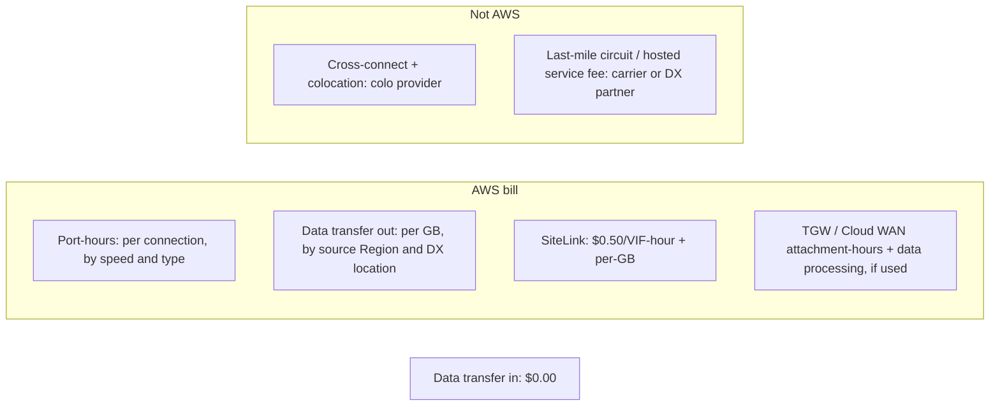

# Pricing

Direct Connect has two billing modes as of September 2026:

- **Pay-as-you-go**: port-hours plus per-GB data transfer out (DTO).
- **Flat-rate**: launched 2026-09-15 for dedicated 10G and 100G connections. It is a fixed hourly rate that includes DTO for the AWS Regions in a chosen tier.

Data into AWS over DX is always free. Cross-connect and colocation fees come from the facility operator, not AWS.

_Prices are USD list prices taken from aws.amazon.com/directconnect/pricing on 2026-09-30, and they exclude tax (Japanese Consumption Tax applies to customers with a Japanese billing address). AWS pricing changes. Always check the live page or the AWS Pricing Calculator. Monthly figures assume 730 hours._

## What you pay for

| Component | Billed by | Notes |
| --- | --- | --- |
| Port-hours | AWS | Charged while the port is provisioned, even with zero traffic. Starts when the port goes active or 90 days after the LOA is issued, whichever comes first. |
| DTO | AWS | Per GB. The rate depends on the **source Region** (or Local Zone) and the **DX location's** geography. With a DX gateway, you pay the rate for the source Region to the DX location where the traffic exits. |
| Data transfer in | AWS | $0.00/GB at all locations |
| DX gateway | AWS | No separate DX gateway charge. AWS states there are "no additional charges to use a multi-account AWS Direct Connect gateway". |
| TGW DX attachment | AWS (Transit Gateway) | Hourly attachment charge, billed to the DXGW owner, plus TGW data processing per GB. Example: $0.05/hour and $0.02/GB in US East (Ohio). |
| SiteLink | AWS | $0.50 per SiteLink-enabled VIF-hour plus per-GB SiteLink transfer |
| Cross-connect and colocation | Colo operator or partner | Not on your AWS bill |
| Hosted connection service | DX partner | The partner's own fees apply on top of AWS hosted port-hours |

## Port-hour prices (pay-as-you-go)

### Dedicated connections

Prices are the same at every DX location worldwide except Japan.

| Speed | $/hour (non-Japan) | ≈ $/month | $/hour (Japan) | ≈ $/month (Japan) |
| --- | --- | --- | --- | --- |
| 1 Gbps | 0.30 | 219.00 | 0.285 | 208.05 |
| 10 Gbps | 2.25 | 1,642.50 | 2.142 | 1,563.66 |
| 100 Gbps | 22.50 | 16,425.00 | 22.50 | 16,425.00 |
| 400 Gbps | 85.00 | 62,050.00 | 85.00 | 62,050.00 |

### Hosted connections

| Capacity | $/hour (non-Japan) | ≈ $/month | $/hour (Japan) |
| --- | --- | --- | --- |
| 50 Mbps | 0.03 | 21.90 | 0.029 |
| 100 Mbps | 0.06 | 43.80 | 0.057 |
| 200 Mbps | 0.08 | 58.40 | 0.076 |
| 300 Mbps | 0.12 | 87.60 | 0.114 |
| 400 Mbps | 0.16 | 116.80 | 0.152 |
| 500 Mbps | 0.20 | 146.00 | 0.190 |
| 1 Gbps | 0.33 | 240.90 | 0.314 |
| 2 Gbps | 0.66 | 481.80 | 0.627 |
| 5 Gbps | 1.65 | 1,204.50 | 1.568 |
| 10 Gbps | 2.48 | 1,810.40 | 2.361 |
| 25 Gbps | 6.20 | 4,526.00 | 6.20 |

The 1 Gbps and higher hosted capacities are available only from select partners. The 25 Gbps hosted capacity was added on 2024-04-24. A hosted 10G costs slightly more per hour than a dedicated 10G ($2.48 versus $2.25), and the partner also charges its own fees.

## Data transfer out: representative rates (USD/GB)

Rows are the source AWS Region. Columns are where the DX location is.

| Source Region to DX location in | Contiguous US | Europe | Japan | Singapore/HK/Korea/Taiwan/Malaysia/Bangkok | Australia/NZ |
| --- | --- | --- | --- | --- | --- |
| Contiguous US (includes GovCloud) | 0.0200 | 0.0200 | 0.0491 | 0.0491 | 0.0600 |
| Europe | 0.0282 | 0.0200 | 0.0600 | 0.0600 | 0.0600 |
| Asia Pacific (Tokyo, Osaka) | 0.0900 | 0.0600 | 0.0410 | 0.0410 | 0.1132 |
| Asia Pacific (Singapore, Seoul, HK, Taiwan, KL, Bangkok) | 0.0900 | 0.0900 | 0.0420 | 0.0410 | 0.1107 |
| Asia Pacific (India) | 0.0850 | 0.0850 | 0.1132 | 0.1000 | 0.1100 |
| Asia Pacific (Australia, Auckland) | 0.1300 | 0.1300 | 0.1132 | 0.1107 | 0.0420 |
| South America (São Paulo, Mexico) | 0.1500 | 0.1107 | 0.1700 | 0.1700 | 0.1800 |

Takeaways:

- **US and Europe, same continent: $0.02/GB.** Tokyo Region to a Japan DX location: **$0.041/GB**, about double. US Region to a Japan DX location: $0.0491/GB. Tokyo Region to a US DX location: $0.09/GB.
- Internet DTO from EC2 is much higher at typical volumes. See the EC2 pricing page. Heavy egress is a classic reason to buy DX.
- For public resources (for example S3 or EC2 with public IPs), DTO is metered at the DX rate only if the destination is a public prefix owned by the **same AWS payer account** and advertised over a public VIF. Otherwise internet DTO rates apply.
- On private and transit VIFs, DTO is charged to the AWS account that sent the data, not to the DX owner.

## SiteLink

- $0.50 per hour per SiteLink-enabled VIF, charged even when idle.
- Per-GB transfer between DX locations. Examples: US to US $0.02, US to Europe $0.0282, Japan to Japan $0.041, Japan to Singapore group $0.042.
- AWS's example: New York and Amsterdam, 2 VIFs each, 100 TB total. That costs $1,460 in SiteLink hours plus $2,887.68 in transfer, for $4,347.68 per month.
- Flat-rate tiers do **not** cover SiteLink traffic.

## Flat-rate pricing (2026-09-15)

| Concept | Detail |
| --- | --- |
| Eligibility | Dedicated connections only (not hosted). Announced for 10 Gbps and 100 Gbps. All commercial Regions except China. |
| What's included | Port plus all DTO from the Regions covered by the chosen tier, for private, public, and transit traffic. DTO from Regions outside the tier is billed at standard DX rates. |
| Tiers | Tier 1 (same metro) to Tier 5 (global). Higher tiers include every path in lower tiers. Tier 1 is cheapest. |
| Port-pair | Two ports on different devices or locations, same speed and tier, grouped in a **resiliency group**. The second port is free. Usable bandwidth = one port (10G pair = 10G). |
| Single flat-rate connection | Allowed, and it costs the **same** as a port-pair. You just don't get the free redundant port. |
| Billing granularity | Hourly, rounded up |
| Switching | You can switch between pay-as-you-go and flat-rate at most 3 times per connection in a rolling 6 months |
| Constraint | All connections in one account at one DX location must use the same billing mode. Use separate accounts to mix modes. LAG members must share a billing mode. |
| Bandwidth change | Not possible. Create a new connection instead. |

AWS's published examples:

| Example | Tier | List rate | Monthly (730 h) |
| --- | --- | --- | --- |
| 10G port-pair at Equinix DC2 Ashburn, traffic from us-east-1 | Tier 1 | $10.96/hour | AWS states $8,000.07 (10.96 × 730 = $8,000.80) |
| 100G port-pair at SFO, traffic from us-east-1 (Tier 2 path) and eu-central-1 (Tier 3 path) | Tier 3 | $219.18/hour | "nearly $160,000" |

### Is flat-rate cheaper? A rough break-even (own calculation)

Compare a 10G Tier 1 port-pair ($10.96/hour) with two pay-as-you-go 10G dedicated ports ($4.50/hour = $3,285/month) plus DTO at $0.02/GB (US to US):

- Flat-rate costs $8,000.80 − $3,285 = $4,715.80 per month more in port charges.
- $4,715.80 ÷ $0.02/GB ≈ 235,790 GB ≈ **230 TB of DTO per month** to break even.

Below about 230 TB/month of same-metro US egress, pay-as-you-go is cheaper. Above it, flat-rate wins and your bill becomes predictable. In higher-priced geographies (for example Tokyo Region to a Japan location at $0.041/GB) the break-even volume is lower, but the tier prices differ too. This is an illustration derived from list prices, not an AWS figure.

## Worked pay-as-you-go examples (from the AWS pricing page)

| Scenario | Ports | Port cost | DTO | Total/month |
| --- | --- | --- | --- | --- |
| High resiliency: 2 locations (Chicago and Columbus), 1 × 2G hosted each, 1 TB out from us-east-2 | 2 × $0.66/hour | $963.60 | 1,024 GB × $0.02 = $20.48 | **$984.08** |
| Maximum resiliency: 2 locations (Newark and Columbus), 2 × 10G dedicated each, 400 TB out from us-east-2, 1 PB in | 4 × $2.25/hour | $6,570.00 | 409,600 GB × $0.02 = $8,192.00 | **$14,762.00** |

The 1 PB of inbound data in the second example costs $0.

## Cost optimization tips

- **Right-size the port.** If you don't need the full capacity of a dedicated port, a hosted connection (50 Mbps to 25 Gbps) may be cheaper. You can also consolidate several small links into one larger port.
- **Keep egress local.** DTO depends on the source Region and the DX location. Serve traffic from the Region associated with your DX location's geography, for example Tokyo Region to Tokyo or Osaka locations at $0.041/GB instead of a US Region to Japan at $0.0491/GB.
- **Use DX instead of the internet for bulk egress.** DX DTO rates are far below internet egress.
- **Consider flat-rate** for heavy, predictable 10G or 100G egress. Pick the lowest tier that covers most of your bytes and let outliers pay standard DTO.
- **Delete unused ports and VIFs.** Port-hours accrue with zero traffic. An ordered but unused port starts billing 90 days after the LOA is issued.
- **Avoid needless TGW hops.** A private VIF to a DXGW to a VGW avoids TGW attachment and processing charges if you don't need transitive routing. TGW is worth it when you have many VPCs.
- **Leave SiteLink off when idle.** It costs $0.50/hour per VIF even without traffic.
- **Size the backup to its job.** A VPN backup is cheaper than a second DX, but it has no SLA. Flat-rate port-pairs include the second port for free.
- **Don't forget non-AWS costs.** Cross-connects (monthly fee to the colo), carrier circuits, and partner fees are often larger than the AWS port-hours for small links.

## Sources

- DX pay-as-you-go pricing (port-hours, DTO table, SiteLink, examples): <https://aws.amazon.com/directconnect/pricing/>
- DX flat-rate pricing (tiers, port-pairs, examples): <https://aws.amazon.com/directconnect/pricing/flat-rate/>
- Flat-rate announcement (2026-09-15): <https://aws.amazon.com/about-aws/whats-new/2026/09/aws-direct-connect-announces-flat-rate-pricing/>
- Flat-rate billing, User Guide: <https://docs.aws.amazon.com/directconnect/latest/UserGuide/flat-rate-connections.html>
- DX Pricing Guide, overview (cross-connect fees): <https://docs.aws.amazon.com/directconnect/latest/PricingGuide/pricing-overview.html>
- DX Pricing Guide, flat-rate: <https://docs.aws.amazon.com/directconnect/latest/PricingGuide/pricing-flat-rate.html>
- What is Direct Connect (billing elements, DXGW no extra charge): <https://docs.aws.amazon.com/directconnect/latest/UserGuide/Welcome.html>
- Dedicated connections (billing start / 90 days): <https://docs.aws.amazon.com/directconnect/latest/UserGuide/dedicated_connection.html>
- 25 Gbps hosted connections (2024-04-24): <https://aws.amazon.com/about-aws/whats-new/2024/04/aws-direct-connect-gbps-hosted-connection-capacities/>
- Transit Gateway pricing: <https://aws.amazon.com/transit-gateway/pricing/>
- Knowledge Center, reduce DX costs: <https://repost.aws/knowledge-center/direct-connect-reduce-costs>
