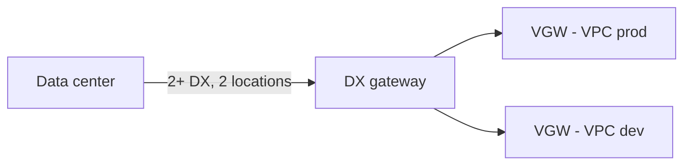
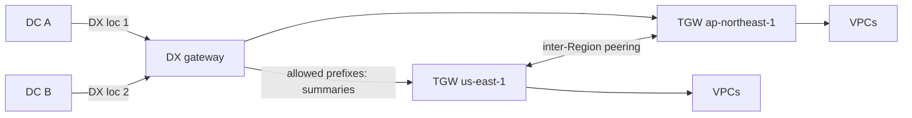
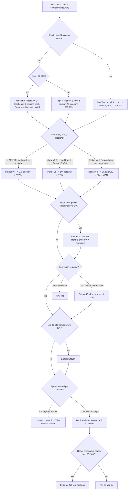

# Design patterns and anti-patterns

This page collects reusable Direct Connect topologies, the mistakes that cause real outages, and a decision tree for choosing a topology. It builds on [Resiliency](07-resiliency.md), [Security](08-security.md), and [Pricing](10-pricing.md).

_Last verified: 2026-09-30._

## Building blocks (quick recap)

| Block | Use it for | Key limits |
| --- | --- | --- |
| Private VIF to VGW | One VPC in the same Region as the DX location | 1 VPC per VIF |
| Private VIF to DX gateway to VGWs | Up to 20 VPCs (VGWs) in any Regions and accounts, no transitive routing | 20 VGWs per DXGW. 30 private or transit VIFs per DXGW. |
| Transit VIF to DX gateway to TGW | Many VPCs through TGW, transitive routing, Private IP VPN | 6 TGWs per DXGW. 4 transit VIFs per dedicated connection. 200 prefixes per TGW advertised to on-premises. |
| Transit VIF to DX gateway to Cloud WAN | Global, policy-driven WAN with segments (since 2024-11-25) | 5,000 prefixes advertised to on-premises. DX communities are not supported inside Cloud WAN. |
| Public VIF | AWS public endpoints (S3, public APIs, VPN endpoints) over DX | 1,000 routes per session |
| SiteLink | Site-to-site traffic between DX locations without going through a Region | $0.50 per VIF-hour plus per-GB |

## Pattern 1: Single Region, few VPCs (private VIF + DXGW)

- Simple and cheap: no TGW attachment or processing charges.
- Use a DX gateway rather than attaching the VIF directly to a VGW, so you can add Regions later without re-cabling.
- The DXGW carries only north-south traffic (on-premises to VPC). It does not route VPC to VPC.

## Pattern 2: Hub-and-spoke with Transit Gateway (transit VIF)

- The standard enterprise pattern for dozens to thousands of VPCs.
- Advertise **summarized** allowed prefixes from each TGW. At most 200 prefixes per TGW go to on-premises, so plan CIDRs so they summarize.
- The TGW ASN must differ from the DXGW ASN. If both use the default 64512, the association fails.
- Private IP VPN runs over the same transit VIF when you need encryption (see [Security](08-security.md)).

## Pattern 3: Global WAN with Cloud WAN

- Attach DX gateways directly to a Cloud WAN core network (no TGW required). Routes propagate by BGP, segments give isolation, and attachments are controlled by tag policies.
- Caveats:
  - A DXGW associated with a core network can't also serve VGWs or TGWs.
  - DX BGP communities are not honored inside Cloud WAN.
  - You can't filter the allowed prefixes advertised to on-premises.
  - The DXGW ASN must be outside the core network ASN range.

## Pattern 4: Public services over DX (public VIF)

- Use it for bulk S3 transfer or IPsec VPN endpoints, or when the organization mandates public-endpoint access without the internet.
- Filter what you accept with the `7224:8100` and `7224:8200` communities. Scope what you advertise with `7224:9100`, `9200`, or `9300`. Put a firewall on the public VIF.
- Alternative: a private VIF plus VPC interface or gateway endpoints keeps everything in private address space.

## Pattern 5: Encrypted DX

| Need | Pattern |
| --- | --- |
| 10G+ dedicated, link encryption | MACsec on the ports or LAG, `must_encrypt` after validation |
| Any speed, end-to-end to the VPC edge, no public IPs | Private IP VPN over transit VIF to TGW |
| Both | MACsec on the physical link plus Private IP VPN or TLS |

## Pattern 6: DX primary, VPN backup

- DX is preferred automatically on both VGW and TGW for the same prefix.
- Advertise the same or less-specific prefixes over the VPN.
- Use TGW VPN with ECMP, or the 5 Gbps Large Bandwidth Tunnels (2025), when the DX is faster than 1 Gbps.

## Pattern 7: Branch-to-branch with SiteLink

- Enable SiteLink on VIFs attached to the same DX gateway. Traffic then takes the shortest path between DX locations without entering a Region.
- It replaces "hairpin through a Region" designs and needs no Region resources.
- Watch the prefix limits (up to 1,000 each for IPv4 and IPv6 with prefix controls). Flat-rate tiers do not cover SiteLink.

## Pattern 8: Multicloud and last mile (2025–2026)

- **AWS Interconnect – multicloud**: previewed 2025-11-30, GA 2026-04-13. It gives managed private links from VPC, TGW, or Cloud WAN to Google Cloud (GA), Oracle OCI (GA 2026-07), and Microsoft Azure (preview 2026-08). There is a free 500 Mbps local tier per Region (from May 2026). Consider it before building DX-to-colo-to-other-cloud chains yourself.
- **AWS Interconnect – last mile**: with Lumen in the US, previewed 2025-11 and GA 2026-04. AWS orchestrates the circuit, BGP, and VLAN from the console. Bandwidth scales from 1 to 100 Gbps, and MACsec is on by default.

## Anti-patterns

| Anti-pattern | Why it hurts | Instead |
| --- | --- | --- |
| Single DX connection for production | No SLA beyond 95%. Every AWS maintenance window becomes an outage. | 2+ locations (High), or 2 × 2 on separate devices (Maximum) |
| Two connections in the same location "for redundancy" | Doesn't survive a location failure. Development/test grade only. | Spread across 2 DX locations |
| Redundant DX links sharing one carrier conduit or one customer router | Hidden shared fate | Diverse carriers and paths, separate routers |
| Every link at 90% utilization | After a failure the survivors are overloaded | Size N+1. Alarm at 70–80%. |
| Static routing or BGP without BFD | 90-second failover, or no failover at all | BGP + BFD (300 ms × 3), graceful restart off |
| Mismatched active/passive (AWS prefers A, on-premises prefers B) | Asymmetric routing breaks stateful firewalls | Communities toward AWS plus matching local-pref on-premises |
| VPN backup advertising more-specific prefixes than DX | VPN becomes primary for return traffic | Same or less-specific over VPN, and filter |
| AS_PATH prepend to demote a VPN | DX wins anyway for equal prefixes, so it creates confusion | Rely on DX-over-VPN preference or prefix length |
| Advertising hundreds of /24s | Blows past the prefix quota. The BGP session goes idle and DOWN. | Summarize. Use prefix controls (up to 1,000). Alarm on `VirtualInterfaceBgpPrefixesAccepted`. |
| Public VIF with no filtering | Accepts all AWS prefixes, and all AWS tenants can reach your advertised prefixes | Firewall plus community filters, or a private VIF plus endpoints |
| Assuming DX is encrypted | It isn't | MACsec and/or IPsec and/or TLS |
| Never testing failover | You only discover the misconfiguration during maintenance | Regular BGP failover test (up to 72 hours) |
| Same ASN on TGW and DXGW | Association fails | Different private ASNs |
| Mixing MTUs across paths | Falls back to 1500, and PMTUD issues | Consistent MTU (9001 private VIF, 8500 transit VIF) |
| Ignoring non-AWS costs | Cross-connects and circuits can dominate | Include colo and carrier costs in the TCO |

## Decision tree: choosing a topology

## Dedicated vs hosted cheat sheet

| Factor | Dedicated | Hosted |
| --- | --- | --- |
| Speeds | 1, 10, 100, 400 Gbps | 50 Mbps to 25 Gbps |
| VIFs | Up to 51 (50 public/private plus up to 4 transit, 51 total) | 1 |
| LAG | Yes (4 × <100G or 2 × 100/400G) | No |
| MACsec | 10/100/400G at select locations | No |
| SLA | Yes, if you meet the deployment requirements | Not covered by the DX SLA |
| Rate limiters | Yes (up to 10) | Always limited to the purchased capacity |
| Flat-rate | Yes (10G/100G) | No |
| Lead time | Order, LOA-CFA, cross-connect | Partner provisions it, you accept |

## Sources

- Quotas: <https://docs.aws.amazon.com/directconnect/latest/UserGuide/limits.html>
- Virtual interfaces and MTU: <https://docs.aws.amazon.com/directconnect/latest/UserGuide/WorkingWithVirtualInterfaces.html>
- Create VIF (TGW/DXGW ASN must differ): <https://docs.aws.amazon.com/directconnect/latest/UserGuide/create-vif.html>
- DX gateways: <https://docs.aws.amazon.com/directconnect/latest/UserGuide/direct-connect-gateways-intro.html>
- DXGW and Transit Gateway associations: <https://docs.aws.amazon.com/directconnect/latest/UserGuide/direct-connect-transit-gateways.html>
- DXGW and Cloud WAN: <https://docs.aws.amazon.com/directconnect/latest/UserGuide/direct-connect-cloud-wan.html>
- Cloud WAN DX attachments (limitations): <https://docs.aws.amazon.com/network-manager/latest/cloudwan/cloudwan-dxattach-about.html>
- Cloud WAN native DX integration (2024-11): <https://aws.amazon.com/about-aws/whats-new/2024/11/aws-cloud-wan-on-premises-connectivity-direct-connect/>
- Routing policies and BGP communities: <https://docs.aws.amazon.com/directconnect/latest/UserGuide/routing-and-bgp.html>
- Resiliency recommendations: <https://aws.amazon.com/directconnect/resiliency-recommendation/>
- Hybrid Connectivity whitepaper, reliability and decision tree: <https://docs.aws.amazon.com/whitepapers/latest/hybrid-connectivity/reliability.html>
- Well-Architected Hybrid Networking Lens, DX and IPsec: <https://docs.aws.amazon.com/wellarchitected/latest/hybrid-networking-lens/aws-direct-connect-and-ipsec-vpn.html>
- SiteLink launch: <https://aws.amazon.com/about-aws/whats-new/2021/12/aws-direct-connect-sitelink/>
- LAG: <https://docs.aws.amazon.com/directconnect/latest/UserGuide/lags.html>
- VIF rate limiters: <https://docs.aws.amazon.com/directconnect/latest/UserGuide/vif-rate-limiters.html>
- AWS Interconnect – multicloud preview (2025-11-30): <https://aws.amazon.com/about-aws/whats-new/2025/11/preview-aws-interconnect-multicloud/>
- AWS Interconnect – multicloud GA (2026-04-13): <https://aws.amazon.com/about-aws/whats-new/2026/04/aws-announces-ga-AWS-interconnect-multicloud/>
- AWS Interconnect – multicloud with OCI GA (2026-07): <https://aws.amazon.com/about-aws/whats-new/2026/07/aws-announces-AWS-interconnect-multicloud-OCI-GA/>
- AWS Interconnect – multicloud with Azure preview (2026-08): <https://aws.amazon.com/about-aws/whats-new/2026/08/aws-announces-AWS-interconnect-multicloud-microsoft-azure-preview/>
- AWS Interconnect – last mile GA (2026-04): <https://aws.amazon.com/about-aws/whats-new/2026/04/aws-announces-ga-AWS-interconnect-last-mile/>
- Knowledge Center, asymmetric routing: <https://repost.aws/knowledge-center/direct-connect-asymmetric-routing>
- DX SLA: <https://aws.amazon.com/directconnect/sla/>
