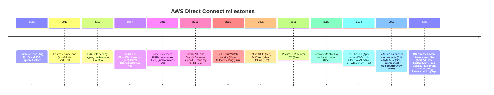

# Timeline

This is a dated history of notable AWS Direct Connect launches, from the 2011 public release to the 2026 flat-rate pricing. Dates come from the DX User Guide document history and from AWS What's New posts. Where the two differ, both are noted.

_Last verified: 2026-09-30._

> Note: Direct Connect launched on **2011-08-03**, not 2012. The 2012 milestones are the new console, the User Guide, IAM support, and more Regions.

## At a glance

## Detailed timeline

| Date | Launch | Why it matters | Source |
| --- | --- | --- | --- |
| 2011-08-03 | Public release of AWS Direct Connect. 1G and 10G ports at Equinix Ashburn for US East. | Dedicated private link to AWS, bypassing the internet | [What's New](https://aws.amazon.com/about-aws/whats-new/2011/08/03/Announcing-AWS-Direct-Connect/), [doc history](https://docs.aws.amazon.com/directconnect/latest/UserGuide/AboutThisGuide.html) |
| 2011-09-08 | US West (N. California) | First expansion | doc history |
| 2012-01-10 | Locations for Ireland, Singapore, Tokyo, N. California | Global footprint begins | doc history |
| 2012-08-13 | New DX console. User Guide replaces the Getting Started Guide. São Paulo added. | Self-service management | doc history |
| 2012-12-21 | IAM support | Access control for DX APIs | doc history |
| 2013-10-22 | Hosted connections | Sub-1G capacity through APN partners | doc history |
| 2013-12-19 | Access to remote AWS Regions (public resources) | One location reaches other Regions' public services | doc history |
| 2014-04-04 | CloudTrail support | API audit trail | doc history |
| 2016-06-22 | Self-service LOA-CFA download | Faster cross-connect ordering | doc history |
| 2016-11-04 | Resource tagging | Tag-based IAM and cost allocation | doc history |
| 2016-12-01 | IPv6 BGP peering on VIFs | Dual-stack hybrid | doc history |
| 2017-02-13 | Link aggregation groups (LAG) | Up to 4 ports as one logical link with one BGP session | doc history, [What's New](https://aws.amazon.com/de/about-aws/whats-new/2017/02/aws-direct-connect-announces-support-for-link-aggregation) |
| 2017-06-29 | CloudWatch connection metrics | Native monitoring | doc history |
| 2017-11-01 | Direct Connect gateway. DTO pricing becomes based on source Region and DX location. | One DX reaches VPCs in any Region (except China) | [What's New](https://aws.amazon.com/about-aws/whats-new/2017/11/aws-direct-connect-enables-global-access/), [blog](https://aws.amazon.com/blogs/aws/new-aws-direct-connect-gateway-inter-region-vpc-access/) |
| 2018-02-06 | Local preference BGP communities (`7224:7100/7200/7300`) | Active/active and active/passive control | doc history |
| 2018-10-11 | Jumbo frames (9001 MTU) | Higher throughput for bulk flows | doc history |
| 2019-03-27 (doc) / April 2019 (What's New) | Transit VIF and Transit Gateway support through DXGW | Hub-and-spoke to thousands of VPCs | doc history, [What's New](https://aws.amazon.com/about-aws/whats-new/2019/04/announcing-aws-direct-connect-support-for-aws-transit-gateway/) |
| 2019-10-07 | Resiliency Toolkit (connection wizard with SLA models) | Guided ordering of redundant connections | doc history |
| 2020-05-11 | CloudWatch VIF metrics | Per-VIF traffic visibility | doc history |
| 2020-06-03 | Resiliency Toolkit failover testing | Test BGP failover on demand (up to 72 hours) | doc history |
| 2021-02 | Native 100 Gbps dedicated connections | No need to LAG 10G links | [What's New](https://aws.amazon.com/about-aws/whats-new/2021/02/aws-direct-connect-announces-native-100-gbps-connections-select-locations/), doc history (2021-02-12) |
| 2021-03-31 | MACsec on 10G and 100G dedicated connections | Line-rate L2 encryption | [What's New](https://aws.amazon.com/about-aws/whats-new/2021/03/aws-direct-connect-announces-macsec-encryption-for-dedicated-10gbps-and-100gbps-connections-at-select-locations/) |
| 2021-12-01/02 | SiteLink | Site-to-site over the AWS backbone between DX locations | [What's New](https://aws.amazon.com/about-aws/whats-new/2021/12/aws-direct-connect-sitelink/), doc history |
| 2022-06-22 | Private IP Site-to-Site VPN over DX transit VIF | IPsec over DX without public IPs | [What's New](https://aws.amazon.com/about-aws/whats-new/2022/06/aws-site-vpn-introduces-private-ip-security-privacy) |
| 2022-08-08 | Transit VIFs on hosted connections of any speed (previously 1/2/5/10 Gbps only) | Sub-1G hosted connections can reach Transit Gateway directly | [What's New](https://aws.amazon.com/about-aws/whats-new/2022/08/aws-direct-connect-expands-transit-gateway-support-connection-speeds/) |
| 2023-06-15 | SiteLink prefix limit documented | Scale guardrail | doc history |
| 2023-12 | CloudWatch Network Monitor GA (later renamed Network Synthetic Monitor) | Packet loss and RTT over DX, plus the AWS Network Health Indicator | [What's New](https://aws.amazon.com/about-aws/whats-new/2023/12/amazon-cloudwatch-network-monitor-generally-available/) |
| 2024-04-24 | 25 Gbps hosted connections | Hosted range becomes 50M to 25G | [What's New](https://aws.amazon.com/about-aws/whats-new/2024/04/aws-direct-connect-gbps-hosted-connection-capacities/) |
| 2024-07-01 | Native 400 Gbps dedicated connections (select locations), MACsec capable | AI/ML-scale data movement | [What's New](https://aws.amazon.com/about-aws/whats-new/2024/07/aws-direct-connect-native-400-gbps-dedicated-connections-select-locations/) |
| 2024-11-25 | Cloud WAN native DX gateway attachment (no TGW needed) | Global policy-based hybrid WAN | [What's New](https://aws.amazon.com/about-aws/whats-new/2024/11/aws-cloud-wan-on-premises-connectivity-direct-connect/) |
| 2025-07-28 | MACsec on partner interconnects | Encrypts the partner-to-AWS hop | [What's New](https://aws.amazon.com/about-aws/whats-new/2025/07/aws-direct-connect-extends-macsec-support-partner-interconnects/) |
| 2025-09-12 (What's New) / 2025-07-24 (doc) | 4-byte (long) ASN on all VIF types | ASNs up to 4,294,967,294 | [What's New](https://aws.amazon.com/about-aws/whats-new/2025/09/aws-direct-connect-4-byte-autonomous-system-numbers/) |
| 2025-11-12 | Site-to-Site VPN 5 Gbps tunnels | Viable VPN backup or overlay for faster DX | [What's New](https://aws.amazon.com/about-aws/whats-new/2025/11/aws-site-to-site-vpn-5-gbps-bandwidth-tunnels) |
| 2025-11 | AWS Interconnect – last mile (Lumen) gated preview | Console-ordered last-mile circuits | [What's New](https://aws.amazon.com/about-aws/whats-new/2025/11/gated-preview-interconnect-last-mile/) |
| 2025-11-30 | AWS Interconnect – multicloud preview (Google Cloud first) | Managed private cloud-to-cloud links | [What's New](https://aws.amazon.com/about-aws/whats-new/2025/11/preview-aws-interconnect-multicloud/) |
| 2026-03 | DX resources in CloudFormation (connections, VIFs, DXGW, LAG, BGP peers) | Infrastructure as code | [What's New](https://aws.amazon.com/about-aws/whats-new/2026/03/aws-direct-connect-supports-aws-cloudformation/) |
| 2026-03-30 | CloudWatch BGP metrics (`VirtualInterfaceBgpStatus`, `PrefixesAccepted`, `PrefixesAdvertised`) | Native BGP alarms | [What's New](https://aws.amazon.com/about-aws/whats-new/2026/03/aws-direct-connect-cloudwatch-bgp-monitoring/) |
| 2026-04-13 | AWS Interconnect – multicloud GA (Google Cloud). Last mile GA in April. | Multicloud without self-managed colo | [What's New](https://aws.amazon.com/about-aws/whats-new/2026/04/aws-announces-ga-AWS-interconnect-multicloud/), [last mile GA](https://aws.amazon.com/about-aws/whats-new/2026/04/aws-announces-ga-AWS-interconnect-last-mile/) |
| 2026-05 | Interconnect – multicloud free 500 Mbps tier | Free local interconnect per Region per cloud provider | [What's New](https://aws.amazon.com/about-aws/whats-new/2026/05/aws-interconnect-multicloud-offers-free-500-mbps-tier/) |
| 2026-06-01 | VIF rate limiters (50 Mbps to 1.6 Tbps, up to 10 per connection) | Noisy-neighbor protection | [What's New](https://aws.amazon.com/about-aws/whats-new/2026/06/aws-direct-connect-now-supports-vif-rate-limiters/) |
| 2026-07-24 | DX SLA document updated (99.99 / 99.9 / 95%) | Current SLA terms | [SLA](https://aws.amazon.com/directconnect/sla/) |
| 2026-07 | Interconnect – multicloud with Oracle OCI GA | Second GA cloud partner | [What's New](https://aws.amazon.com/about-aws/whats-new/2026/07/aws-announces-AWS-interconnect-multicloud-OCI-GA/) |
| 2026-07-30 | BGP route visibility (`ListVirtualInterfaceRoutes`) | See accepted and advertised routes per VIF | [What's New](https://aws.amazon.com/about-aws/whats-new/2026/07/aws-direct-connect-bgp-visibility/), doc history |
| 2026-08 | Interconnect – multicloud with Microsoft Azure preview | Third cloud partner | [What's New](https://aws.amazon.com/about-aws/whats-new/2026/08/aws-announces-AWS-interconnect-multicloud-microsoft-azure-preview/) |
| 2026-08-20 | Inbound prefix controls: up to 1,000 IPv4 and 1,000 IPv6 prefixes per private or transit VIF (was 100) | Removes the 100-route constraint | [What's New](https://aws.amazon.com/about-aws/whats-new/2026/08/aws-direct-connect-new-prefix-controls/) |
| 2026-09-15 | Flat-rate pricing for dedicated 10G and 100G with port-pairs and 5 geographic tiers | Predictable bills, with the redundant port included | [What's New](https://aws.amazon.com/about-aws/whats-new/2026/09/aws-direct-connect-announces-flat-rate-pricing/), doc history |

## Location footprint

AWS What's New posts give the running count of DX locations: "over 142" (2025-08), "over 146" (2025-09 to 2025-10), "over 149" (2025-12), and "over 150" (2026-03 to 2026-04). Recent additions include Hanoi (the first in Vietnam, 2025-12) and Sydney SY5 (2026-03). 100G expansions include Kansas City (2025-10), Auckland (2026-04), and Lima (2026-07). The GDS No. 3 Shenzhen location stopped accepting new connections after 2026-06-30, with end of support in July 2027.

## Sources

- DX User Guide document history: <https://docs.aws.amazon.com/directconnect/latest/UserGuide/AboutThisGuide.html>
- Announcing AWS Direct Connect (2011-08-03): <https://aws.amazon.com/about-aws/whats-new/2011/08/03/Announcing-AWS-Direct-Connect/>
- LAG (2017-02): <https://aws.amazon.com/de/about-aws/whats-new/2017/02/aws-direct-connect-announces-support-for-link-aggregation>
- LAG blog: <https://aws.amazon.com/blogs/aws/aws-direct-connect-update-link-aggregation-groups-bundles-and-reinvent-recap/>
- DX gateway (2017-11-01): <https://aws.amazon.com/about-aws/whats-new/2017/11/aws-direct-connect-enables-global-access/>
- DX gateway blog: <https://aws.amazon.com/blogs/aws/new-aws-direct-connect-gateway-inter-region-vpc-access/>
- TGW support (2019-04): <https://aws.amazon.com/about-aws/whats-new/2019/04/announcing-aws-direct-connect-support-for-aws-transit-gateway/>
- Native 100G (2021-02): <https://aws.amazon.com/about-aws/whats-new/2021/02/aws-direct-connect-announces-native-100-gbps-connections-select-locations/>
- MACsec (2021-03-31): <https://aws.amazon.com/about-aws/whats-new/2021/03/aws-direct-connect-announces-macsec-encryption-for-dedicated-10gbps-and-100gbps-connections-at-select-locations/>
- SiteLink (2021-12): <https://aws.amazon.com/about-aws/whats-new/2021/12/aws-direct-connect-sitelink/>
- Private IP VPN (2022-06-22): <https://aws.amazon.com/about-aws/whats-new/2022/06/aws-site-vpn-introduces-private-ip-security-privacy>
- Network Monitor GA (2023-12): <https://aws.amazon.com/about-aws/whats-new/2023/12/amazon-cloudwatch-network-monitor-generally-available/>
- 25G hosted (2024-04-24): <https://aws.amazon.com/about-aws/whats-new/2024/04/aws-direct-connect-gbps-hosted-connection-capacities/>
- 400G (2024-07-01): <https://aws.amazon.com/about-aws/whats-new/2024/07/aws-direct-connect-native-400-gbps-dedicated-connections-select-locations/>
- Cloud WAN plus DX (2024-11-25): <https://aws.amazon.com/about-aws/whats-new/2024/11/aws-cloud-wan-on-premises-connectivity-direct-connect/>
- MACsec partner interconnects (2025-07-28): <https://aws.amazon.com/about-aws/whats-new/2025/07/aws-direct-connect-extends-macsec-support-partner-interconnects/>
- 4-byte ASN (2025-09-12): <https://aws.amazon.com/about-aws/whats-new/2025/09/aws-direct-connect-4-byte-autonomous-system-numbers/>
- VPN 5 Gbps tunnels (2025-11-12): <https://aws.amazon.com/about-aws/whats-new/2025/11/aws-site-to-site-vpn-5-gbps-bandwidth-tunnels>
- Interconnect last mile preview (2025-11): <https://aws.amazon.com/about-aws/whats-new/2025/11/gated-preview-interconnect-last-mile/>
- Interconnect multicloud preview (2025-11-30): <https://aws.amazon.com/about-aws/whats-new/2025/11/preview-aws-interconnect-multicloud/>
- Kansas City 100G (2025-10): <https://aws.amazon.com/about-aws/whats-new/2025/10/aws-direct-connect-100g-expansion-kansas-city/>
- Hanoi location (2025-12): <https://aws.amazon.com/about-aws/whats-new/2025/12/aws-direct-connect-hanoi/>
- CloudFormation support (2026-03): <https://aws.amazon.com/about-aws/whats-new/2026/03/aws-direct-connect-supports-aws-cloudformation/>
- Sydney SY5 (2026-03): <https://aws.amazon.com/about-aws/whats-new/2026/03/aws-direct-connect-sydney-sy5/>
- BGP CloudWatch metrics (2026-03-30): <https://aws.amazon.com/about-aws/whats-new/2026/03/aws-direct-connect-cloudwatch-bgp-monitoring/>
- Interconnect multicloud GA (2026-04-13): <https://aws.amazon.com/about-aws/whats-new/2026/04/aws-announces-ga-AWS-interconnect-multicloud/>
- Interconnect last mile GA (2026-04): <https://aws.amazon.com/about-aws/whats-new/2026/04/aws-announces-ga-AWS-interconnect-last-mile/>
- Auckland 100G (2026-04): <https://aws.amazon.com/about-aws/whats-new/2026/04/aws-direct-connect-100g-auckland/>
- Interconnect free 500 Mbps tier (2026-05): <https://aws.amazon.com/about-aws/whats-new/2026/05/aws-interconnect-multicloud-offers-free-500-mbps-tier/>
- VIF rate limiters (2026-06-01): <https://aws.amazon.com/about-aws/whats-new/2026/06/aws-direct-connect-now-supports-vif-rate-limiters/>
- Interconnect with OCI GA (2026-07): <https://aws.amazon.com/about-aws/whats-new/2026/07/aws-announces-AWS-interconnect-multicloud-OCI-GA/>
- Lima 100G (2026-07): <https://aws.amazon.com/about-aws/whats-new/2026/07/aws-direct-connect-100g-lima/>
- BGP route visibility (2026-07): <https://aws.amazon.com/about-aws/whats-new/2026/07/aws-direct-connect-bgp-visibility/>
- Interconnect with Azure preview (2026-08): <https://aws.amazon.com/about-aws/whats-new/2026/08/aws-announces-AWS-interconnect-multicloud-microsoft-azure-preview/>
- Prefix controls (2026-08-20): <https://aws.amazon.com/about-aws/whats-new/2026/08/aws-direct-connect-new-prefix-controls/>
- Flat-rate pricing (2026-09-15): <https://aws.amazon.com/about-aws/whats-new/2026/09/aws-direct-connect-announces-flat-rate-pricing/>
- DX SLA: <https://aws.amazon.com/directconnect/sla/>
