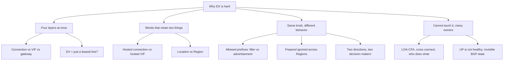

# Why Direct Connect is hard to understand

This page records the concrete confusion points that make AWS Direct Connect (DX) hard to learn, with evidence, and the explainer technique the site uses for each. It drives the design of the web app: every item below maps to a fix in a specific section. Research was done on 2026-09-30 across AWS re:Post and Knowledge Center, AWS docs, practitioner blogs, certification study guides, and Japanese community sources (Qiita, Zenn, DevelopersIO, Serverworks, AWS Japan blog, Black Belt).

## The short answer

DX is hard for four structural reasons, and almost every specific confusion is one of them in disguise:

1. **Four worlds at once.** A single feature spans L1 (fiber, optics, a colocation building), L2 (VLANs, LACP, MACsec), L3 (BGP) and AWS resources (VIF, DXGW, VGW, TGW, Cloud WAN). Most engineers are fluent in one or two of these.
2. **Words that mean two things.** "Hosted" (connection vs VIF), "allowed prefixes" (filter vs advertisement), "location" vs "Region", "DX" itself (Direct Connect vs デジタルトランスフォーメーション in Japanese), and vendor labels (占有型 / 共有型) that do not match the console.
3. **The same knob behaves differently by context.** Allowed prefixes on a VGW vs a TGW, AS_PATH prepend within a Region vs across Regions, prepend on a private vs a public ASN, MTU 9001 vs 8500.
4. **You cannot touch it.** There is no free-tier DX, several companies own different pieces (you, AWS, the colo, the carrier, the partner, often an SIer in Japan), and before 2026 BGP state was not even visible in CloudWatch.

## Ranked confusion points

| # | Confusion | What people get wrong | Evidence | Fix on the site |
| --- | --- | --- | --- | --- |
| 1 | Connection vs VIF vs gateway | Cannot tell the physical port from the VLAN + BGP session from the routing hub; a community re:Post answer claimed a private VIF can terminate on a TGW | [re:Post](https://repost.aws/questions/QUDhR9gi2XTwCHj9nDjkUSBg/when-to-use-transit-vif-vs-private-vif-with-aws-transit-gateway-and-direct-connect), [Serverworks](https://blog.serverworks.co.jp/2021/04/05/100639) | Layer stack map, layer chips on every section, VIF switcher |
| 2 | "DX = a leased line from AWS" | AWS only provides location ↔ AWS; you arrange site ↔ location | [Serverworks](https://blog.serverworks.co.jp/2021/04/05/100639), [Zenn](https://zenn.dev/issy/articles/zenn-directconnect-overview) | Airport analogy, ownership-colored path diagram |
| 3 | Allowed prefixes mean opposite things | VGW: filter (same or wider than the VPC CIDR). TGW: the literal advertisement | [AWS doc](https://docs.aws.amazon.com/directconnect/latest/UserGuide/allowed-to-prefixes.html), [DevelopersIO](https://dev.classmethod.jp/articles/aws-direct-connect-gateway-allowed-prefixes-explained-simply/), [Colin Barker](https://colinbarker.me.uk/blog/2024-10-21-aws-direct-connect-allowed-prefix-lists/) | Allowed-prefix lab with "checkpoint vs signboard" analogy |
| 4 | DXGW is not a router | Expect VPC ↔ VPC or VIF ↔ VIF through it; it is a control-plane route reflector | [AWS doc](https://docs.aws.amazon.com/directconnect/latest/UserGuide/direct-connect-gateways-intro.html) | SiteLink toggle with a red ✕, myth card |
| 5 | Why is traffic on the VPN? | Longest prefix beats "DX over VPN" | [Knowledge Center](https://www.repost.aws/knowledge-center/direct-connect-gateway-primary-connection), [VPC route priority](https://docs.aws.amazon.com/vpc/latest/userguide/route-tables-priority.html) | BGP lab preset "VPN wins with a /24", decision ladder |
| 6 | Two directions, two decision makers | Fixing AWS → on-prem with communities but not on-prem → AWS gives asymmetric flows that stateful firewalls drop | [KC asymmetric](https://repost.aws/knowledge-center/direct-connect-asymmetric-routing), [Zenn](https://zenn.dev/yama_1998/articles/02db97e12a61f5) | BGP lab: separate outbound choice and an asymmetry warning |
| 7 | Prepend ignored across Regions | Locations in the sending Region are preferred before AS_PATH is compared | [Routing policies](https://docs.aws.amazon.com/directconnect/latest/UserGuide/routing-and-bgp.html), [KC active/passive](https://repost.aws/knowledge-center/direct-connect-active-passive-connection) | BGP lab preset "Remote-Region location", myth card |
| 8 | "Hosted" means two things | Hosted connection (own policed capacity, 1 VIF) vs hosted VIF (a VIF on someone else's port) | [KC types](https://repost.aws/knowledge-center/direct-connect-types), [NHN Techorus](https://techblog.nhn-techorus.com/archives/23184) | Apartment analogy, glossary "not to be confused with" |
| 9 | Vendor labels vs console terms | 占有型 / 共有型 are marketing labels with loose meaning | [DevelopersIO](https://dev.classmethod.jp/articles/aws-direct-connect-connection-vif-organize-terms/) | Glossary lists official console terms in both languages |
| 10 | Public VIF is not "internet" | It reaches AWS public prefixes only; your prefixes become reachable from all of AWS; needs verified public IPs | [KC verifying](https://repost.aws/knowledge-center/public-vif-stuck-verifying) | VIF switcher note, security callout, myth card |
| 11 | Scope communities are backwards-prone | 9100/9200/9300 tag your prefixes; 8100/8200 tag AWS's; the 2026 route-visibility page labels them in reverse | [Routing policies](https://docs.aws.amazon.com/directconnect/latest/UserGuide/routing-and-bgp.html), [Route visibility](https://docs.aws.amazon.com/directconnect/latest/UserGuide/bgp-route-visibility.html) | Community cheat sheet with explicit direction |
| 12 | Location vs Region | The associated Region is a default preference, not a reach limit; e.g. Equinix OS1 in Osaka is associated with Tokyo | [Remote Regions](https://docs.aws.amazon.com/directconnect/latest/UserGuide/remote_regions.html), [AWS JP blog](https://aws.amazon.com/jp/blogs/news/aws-direct-connect-osaka2-20250414/) | Overview backbone note, myth card |
| 13 | LOA-CFA and who does what | Mistaken for a config value; it is a signed work permit the colo needs to patch a fiber into AWS's port | [AWS doc](https://docs.aws.amazon.com/directconnect/latest/UserGuide/Colocation.html), [Qiita](https://qiita.com/R61/items/feb00b25113c8a068c6a) | Ordering stepper with an owner per step, permit analogy |
| 14 | LAG is not resiliency | The FAQ says a LAG does not make connectivity more resilient: one device, one location | [DX FAQ](https://aws.amazon.com/directconnect/faqs/) | LAG lab callout, myth card |
| 15 | UP is not healthy | In the 2021-09-02 Tokyo DX incident, connections showed UP while dropping packets | [DevelopersIO](https://dev.classmethod.jp/articles/directconnect-redundantize/) | Resiliency callout, grey-failure step in troubleshooting |
| 16 | Invisible state | No BGP status or prefix metrics in CloudWatch until 2026-03-30; prefix overflow silently sends BGP Idle | [What's New](https://aws.amazon.com/about-aws/whats-new/2026/03/aws-direct-connect-cloudwatch-bgp-monitoring), [KC BGP down](https://repost.aws/knowledge-center/direct-connect-down-bgp) | Operations metrics table, troubleshooting tree |
| 17 | MTU differs by VIF type | Private VIF 9001, transit VIF and TGW 8500; oversize packets drop and PMTUD can fail | [VIF doc](https://docs.aws.amazon.com/directconnect/latest/UserGuide/WorkingWithVirtualInterfaces.html) | MTU table and callout |
| 18 | "Closed network = encrypted" (閉域 = 暗号化) | DX is plaintext by default; MACsec is hop-by-hop on dedicated ports only | [Encryption doc](https://docs.aws.amazon.com/directconnect/latest/UserGuide/encryption-in-transit.html) | Encryption-layer diagram, myth card |
| 19 | Who pays what | Port-hours to the connection owner, DTO to the sending account, colo and carrier bill separately | [Multi-account pricing blog](https://aws.amazon.com/blogs/networking-and-content-delivery/understanding-aws-direct-connect-multi-account-pricing/) | Pricing "who gets billed" list |
| 20 | DX hidden inside a carrier service (Japan) | Carrier closed-network services contain DX; unclear which failures are AWS's vs the carrier's | [Zenn NTT Data](https://zenn.dev/nttdata_tech/articles/2562c529df1c12) | "Where DX hides in your carrier's service" note |
| 21 | You cannot try it | No personal-account lab; ANS-C01 still tests VIFs, LAG, DXGW and BGP attributes in depth | [Tutorials Dojo](https://tutorialsdojo.com/aws-certified-advanced-networking-specialty-exam-study-path-guide-ans-c01/) | Every lab on the site is a browser simulator |

## Analogies that work

| Concept | Analogy | Where it comes from |
| --- | --- | --- |
| DX location | An airport: your carrier circuit is the airport bus, the AWS router is the boarding gate | Serverworks |
| LOA-CFA | A signed work permit that lets the building's staff plug a cable into AWS's port | Qiita, community |
| VIF | Lanes painted on one road: each lane (VLAN) goes to a different destination | This site |
| Hosted connection vs hosted VIF | Renting a whole flat vs renting a room in someone else's flat | NHN Techorus |
| Allowed prefixes | VGW: a checkpoint that lets matching cars through. TGW: a signboard that announces exactly what is written on it | DevelopersIO |
| DXGW | A switchboard operator that tells callers where to go, but never carries the call between two phones on its own side | This site |

## Official Japanese terms

The AWS Japanese documentation uses these terms, which the glossary on the site follows. Community writing often differs.

| English | AWS Japanese docs | Community variants |
| --- | --- | --- |
| Connection | 接続 | 回線 |
| Dedicated connection | 専用接続 | 占有型 (vendor label) |
| Hosted connection | ホスト接続 | ホスト型接続, 共有型 (vendor label) |
| Virtual interface | 仮想インターフェイス | 仮想インターフェース, VIF |
| Hosted VIF | ホスト仮想インターフェイス | ホスト型 VIF |
| Direct Connect gateway | Direct Connect ゲートウェイ | DXGW |
| Virtual private gateway | 仮想プライベートゲートウェイ | VGW |
| Allowed prefixes | 許可されたプレフィックス / 許可されるプレフィックス (both appear) | 許可プレフィックス |
| Link aggregation group | リンク集約グループ (LAG) | LAG |
| LOA-CFA | LOA-CFA (untranslated) | 接続承認書 |

## Sources

- <https://repost.aws/questions/QUDhR9gi2XTwCHj9nDjkUSBg/when-to-use-transit-vif-vs-private-vif-with-aws-transit-gateway-and-direct-connect>
- <https://docs.aws.amazon.com/directconnect/latest/UserGuide/allowed-to-prefixes.html>
- <https://docs.aws.amazon.com/ja_jp/directconnect/latest/UserGuide/allowed-to-prefixes.html>
- <https://colinbarker.me.uk/blog/2024-10-21-aws-direct-connect-allowed-prefix-lists/>
- <https://docs.aws.amazon.com/directconnect/latest/UserGuide/direct-connect-gateways-intro.html>
- <https://www.repost.aws/knowledge-center/direct-connect-gateway-primary-connection>
- <https://docs.aws.amazon.com/vpc/latest/userguide/route-tables-priority.html>
- <https://repost.aws/knowledge-center/direct-connect-asymmetric-routing>
- <https://repost.aws/knowledge-center/direct-connect-active-passive-connection>
- <https://docs.aws.amazon.com/directconnect/latest/UserGuide/routing-and-bgp.html>
- <https://docs.aws.amazon.com/directconnect/latest/UserGuide/bgp-route-visibility.html>
- <https://repost.aws/knowledge-center/direct-connect-types>
- <https://repost.aws/knowledge-center/public-vif-stuck-verifying>
- <https://docs.aws.amazon.com/directconnect/latest/UserGuide/remote_regions.html>
- <https://docs.aws.amazon.com/directconnect/latest/UserGuide/Colocation.html>
- <https://aws.amazon.com/directconnect/faqs/>
- <https://repost.aws/knowledge-center/direct-connect-down-bgp>
- <https://aws.amazon.com/about-aws/whats-new/2026/03/aws-direct-connect-cloudwatch-bgp-monitoring>
- <https://docs.aws.amazon.com/directconnect/latest/UserGuide/WorkingWithVirtualInterfaces.html>
- <https://docs.aws.amazon.com/directconnect/latest/UserGuide/encryption-in-transit.html>
- <https://aws.amazon.com/blogs/networking-and-content-delivery/understanding-aws-direct-connect-multi-account-pricing/>
- <https://tutorialsdojo.com/aws-certified-advanced-networking-specialty-exam-study-path-guide-ans-c01/>
- <https://blog.serverworks.co.jp/2021/04/05/100639>
- <https://zenn.dev/issy/articles/zenn-directconnect-overview>
- <https://dev.classmethod.jp/articles/aws-direct-connect-connection-vif-organize-terms/>
- <https://dev.classmethod.jp/articles/aws-direct-connect-gateway-allowed-prefixes-explained-simply/>
- <https://dev.classmethod.jp/articles/directconnect-redundantize/>
- <https://techblog.nhn-techorus.com/archives/23184>
- <https://qiita.com/R61/items/feb00b25113c8a068c6a>
- <https://zenn.dev/yama_1998/articles/02db97e12a61f5>
- <https://zenn.dev/nttdata_tech/articles/2562c529df1c12>
- <https://aws.amazon.com/jp/blogs/news/aws-direct-connect-osaka2-20250414/>
